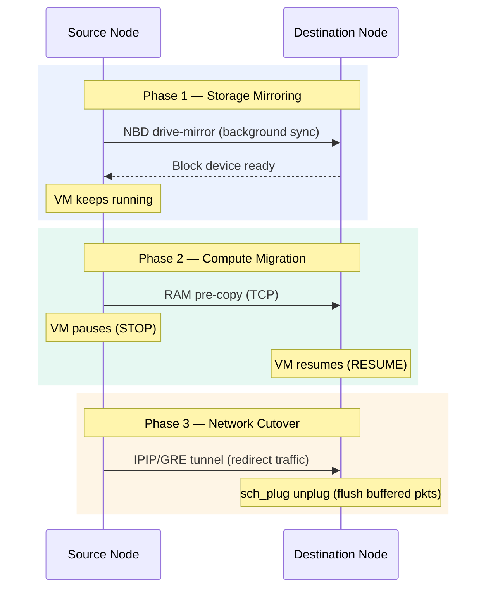
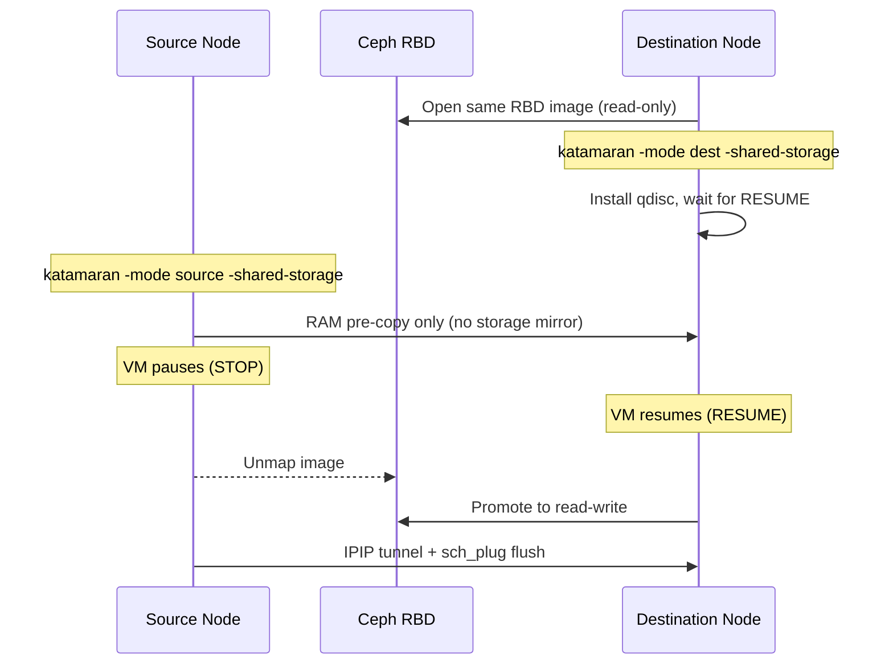
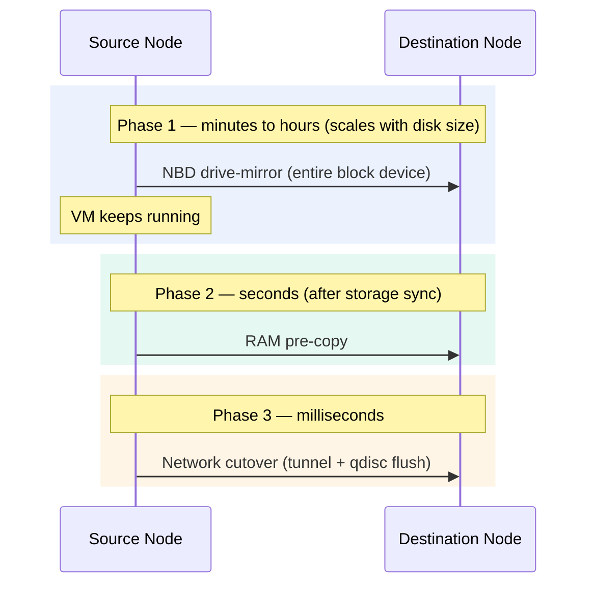
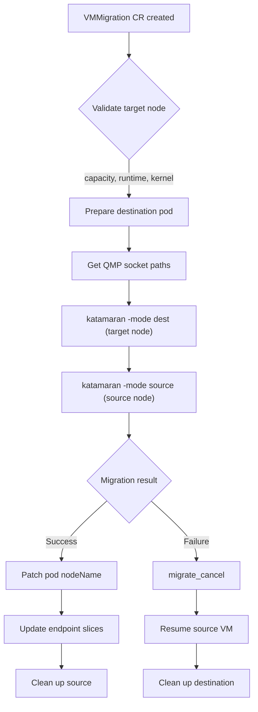

<div align="center">
  
  <h1>katamaran</h1>
  <p><b>Zero-drop live migration for Kata Containers</b></p>
</div>

Zero-packet-drop live migration for [Kata Containers](https://katacontainers.io/).

### TL;DR

```bash
go build -o katamaran ./cmd/katamaran/

# Destination node (run first)
sudo ./katamaran -mode dest -qmp /run/vc/vm/<id>/qmp.sock -tap tap0_kata

# Source node
sudo ./katamaran -mode source -qmp /run/vc/vm/<id>/qmp.sock \
  -dest-ip <dest-node-ip> -vm-ip <pod-ip>
```

Three-phase migration: **storage** (NBD drive-mirror) → **compute** (RAM pre-copy) → **network** (IPIP/GRE tunnel + sch_plug qdisc). Packets arriving during the VM pause are buffered and flushed on resume — zero drops. Add `-shared-storage` with Ceph/NFS to skip the storage phase entirely.

---

Supports both **local storage** (NBD drive-mirror) and **shared storage** (Ceph, NFS — skip mirroring with `-shared-storage`).

Traditional QEMU live migration assumes shared storage. In Kubernetes with Kata Containers, pods typically use local virtio-blk disks — meaning the entire block device must be migrated alongside RAM and network state. `katamaran` orchestrates all three phases in the correct order while guaranteeing **zero in-flight packet drops** during the cutover.

> *Like a catamaran glides between two hulls, katamaran glides your VM between two nodes — smoothly, with nothing lost overboard.*

---

## Table of Contents
- [Architecture Overview](#architecture-overview)
  - [Phase 1 — Storage Mirroring](#phase-1--storage-mirroring-nbd--drive-mirror)
  - [Phase 2 — Compute Migration](#phase-2--compute-migration-ram-pre-copy--final-incremental-copy)
  - [Phase 3 — Zero-Drop Network Cutover](#phase-3--zero-drop-network-cutover-tc-sch_plug--ip-tunnel)
- [Prerequisites](#prerequisites)
- [Project Structure](#project-structure)
- [Usage](#usage)
  - [Destination Node](#destination-node-run-first)
  - [Source Node](#source-node-run-after-destination-is-ready)
  - [Shared Storage Mode](#shared-storage-mode)
  - [IPv6 Networks](#ipv6-networks)
  - [Cloud VPC Networks](#cloud-vpc-networks-gre-mode)
  - [CLI Flags](#cli-flags)
- [Why Sequential Pre-Copy?](#why-sequential-pre-copy)
- [Kubernetes Integration](#kubernetes-integration)
- [Testing](#testing)

---

## Architecture Overview

Migration proceeds in three sequential phases:



### Phase 1 — Storage Mirroring (NBD + drive-mirror)

The destination QEMU starts an NBD server exporting the target block device. The source issues a `drive-mirror` QMP command that copies every block to the remote NBD target in the background while the VM keeps running. Dirty blocks are re-synced continuously until the mirror reports `ready` (fully synchronized).

### Phase 2 — Compute Migration (RAM Pre-Copy & Final Incremental Copy)

Once storage is synchronized, the source starts standard QEMU RAM pre-copy migration (`migrate` QMP command) with `auto-converge` enabled. QEMU iteratively copies dirty RAM pages while the VM continues to run.

To achieve true "zero downtime" perception, `katamaran` explicitly configures QEMU with a strict **50ms downtime limit** and uncaps the migration bandwidth to 10GB/s. This forces QEMU to keep iterating until the remaining dirty RAM can be transferred in under 50 milliseconds.

Once the remaining dirty RAM set is small enough to transfer within this 50ms budget, the VM pauses (emitting the `STOP` event). **At this very last bit, QEMU performs a final incremental copy** of the remaining dirty RAM pages and in-flight storage blocks. Only after this final incremental copy completes does the destination VM resume (emitting the `RESUME` event).

### Phase 3 — Zero-Drop Network Cutover (tc sch_plug + IP Tunnel)

The critical downtime window — between `STOP` on the source and `RESUME` on the destination — is where packets would normally be lost. `katamaran` eliminates this:

1. **Source side**: Immediately after `STOP`, an IP tunnel is created pointing at the destination node. The tunnel encapsulation is selected by `-tunnel-mode`: with the default `ipip`, an IPIP tunnel is used for IPv4 (`mode ipip`) and an ip6tnl tunnel for IPv6 (`mode ip6ip6`); with `gre`, a GRE tunnel is used for IPv4 (`mode gre`) and an ip6gre tunnel for IPv6. GRE is recommended on cloud VPCs (AWS, GCP, Azure) where IPIP (IP protocol 4/41) is often blocked by security groups, while GRE (IP protocol 47) is widely permitted. A host route for the VM IP is added through the tunnel, forwarding any packets that arrive at the (now stale) source to the destination.
2. **Destination side**: A `tc sch_plug` qdisc on the destination tap interface buffers all arriving packets (including those forwarded through the tunnel). The qdisc is installed in pass-through mode (`release_indefinite`) and only switched to buffering (`block`) just before the expected RESUME. When the VM resumes, the queue is unplugged with `release_indefinite`, flushing all buffered packets into the now-running VM in order. QEMU's `announce-self` QMP command then broadcasts Gratuitous ARP using the guest's actual MAC address, ensuring switches learn the correct port binding immediately.

The result: packets that arrive during the switchover are queued, not dropped. After the CNI control plane converges (seconds later), new traffic flows directly to the destination and the tunnel is torn down.

---

## Prerequisites

| Component | Minimum Version | Notes |
|-----------|----------------|-------|
| **QEMU** | 6.2+ | Must support `drive-mirror`, `nbd-server-start`, `announce-self`, QMP |
| **Kata Containers** | 3.x | QMP socket must be accessible |
| **iproute2** | any | `tc` (sch_plug qdisc) + `ip tunnel` (IPIP/GRE/ip6tnl/ip6gre) |
| **Go** | 1.22+ | Install system-wide |

### CNI Considerations

| CNI | Compatibility | Notes |
|-----|--------------|-------|
| **OVN-Kubernetes** | Excellent | OVN southbound DB rebinds port-chassis near-instantly. GARP accelerates MAC learning. Tested via `minikube-ovn-e2e.sh`. |
| **Kube-OVN** | Excellent | Also OVN-based (separate project by Alauda). Same port-chassis rebinding mechanism. Subnet/VPC features are a bonus. |
| **Cilium** | Good | Works with IP tunnel + GARP. eBPF datapath reconverges after endpoint re-registration. |
| **Calico** | Good | IPIP/VXLAN modes work. BGP route propagation delay is covered by the tunnel. |
| **Flannel** | Basic | VXLAN FDB entries may need manual nudging. IP tunnel covers the gap. |

---

## Project Structure

```text
go.mod                          # Go module declaration
Dockerfile                      # Multi-stage container image build
.dockerignore                   # Build context exclusions
cmd/
  katamaran/
    main.go                     # CLI entry point — flag parsing and dispatch
internal/
  migration/
    config.go                   # Constants, CleanupCtx, and RunCmd helper
    dest.go                     # Destination-side migration logic
    source.go                   # Source-side migration logic and polling
    tunnel.go                   # IP tunnel setup/teardown (IPIP/GRE/ip6ip6/ip6gre)
  qmp/
    client.go                   # QMP client (connect, execute, wait for events)
    types.go                    # QMP protocol types and command argument structs
deploy/
  daemonset.yaml                # DaemonSet for binary installation on nodes
  job-dest.yaml                 # Job template for destination-side migration
  job-source.yaml                # Job template for source-side migration
  migrate.sh                    # Orchestration wrapper for Job-based migration
README.md                       # This file
docs/
  TESTING.md                    # Test environment guide
  STORIES.md                    # User stories
testenv/                        # Test infrastructure
  test.sh                       # Smoke tests (no VMs required)
  minikube-test.sh              # Single-node Kata QMP smoke test (requires KVM)
  minikube-e2e.sh               # Two-node live migration E2E test (Calico CNI)
  minikube-ovn-e2e.sh           # Two-node E2E with OVN-Kubernetes + zero-drop ping proof
  minikube-nfs-e2e.sh           # Two-node E2E with NFS shared storage + zero-drop ping proof
  kind-e2e.sh                   # Two-node E2E with Kind + Podman + zero-drop ping proof
  job-e2e.sh                    # Two-node E2E with Kind + Podman + Jobs + zero-drop ping proof
```

---

## Container Image

Build the container image (required for Kubernetes deployment):

```bash
podman build -t katamaran:dev .
```

The multi-stage build produces a minimal Alpine image (~20 MB) with
`iproute2` (for `ip` and `tc` commands) and the katamaran binary.

Run directly from the image:

```bash
podman run --rm katamaran:dev -help
```

---

## Usage

Build the tool:

```bash
go build -o katamaran ./cmd/katamaran/
```

> [!TIP]
> `katamaran` handles graceful shutdowns safely. If you send a `SIGINT` (`Ctrl+C`) or `SIGTERM` during an active migration, it will gracefully abort the QMP operations, automatically delete any `tc` queue disciplines, and tear down any temporary IP tunnels to leave the host networking state completely clean.

### Destination Node (run first)

```bash
sudo ./katamaran \
  -mode dest \
  -qmp /run/vc/vm/<sandbox-id>/qmp.sock \
  -tap tap0_kata \
  -drive-id drive-virtio-disk0
```

This will:
1. Install a `sch_plug` qdisc on the tap interface in pass-through mode (non-fatal if unavailable)
2. Start an NBD server on port `10809` for storage mirroring (skipped with `-shared-storage`)
3. Plug the network queue to buffer in-flight packets (skipped if step 1 failed)
4. Wait for the VM to resume (`RESUME` event)
5. Flush all buffered packets via `release_indefinite` (skipped if step 1 failed)
6. Stop the NBD server (skipped with `-shared-storage`)
7. Send Gratuitous ARP via QEMU `announce-self` (uses correct guest MAC)

### Source Node (run after destination is ready)

```bash
sudo ./katamaran \
  -mode source \
  -qmp /run/vc/vm/<sandbox-id>/qmp.sock \
  -dest-ip 10.0.1.42 \
  -vm-ip 10.244.1.15 \
  -drive-id drive-virtio-disk0
```

This will:
1. Start `drive-mirror` to the destination NBD server (skipped with `-shared-storage`)
2. Wait for storage to fully synchronize (skipped with `-shared-storage`)
3. Configure and begin RAM pre-copy migration with auto-converge
4. Wait for VM pause (`STOP` event — downtime window begins)
5. Create an IP tunnel to redirect in-flight traffic to destination (IPIP or GRE, auto-selected by address family)
6. Monitor migration until completion (bounded by `migrationTimeout`)
7. Cancel migration via `migrate_cancel` if it failed or timed out
8. Abort the block mirror with `force:true` cancel (skipped with `-shared-storage`)
9. Tear down the IP tunnel after CNI convergence delay

### Shared Storage Mode

If both nodes share a storage backend (e.g., Ceph RBD, NFS), skip the NBD drive-mirror phase entirely with `-shared-storage`:

```bash
# Destination
sudo ./katamaran -mode dest -shared-storage \
  -qmp /run/vc/vm/<sandbox-id>/qmp.sock -tap tap0_kata

# Source
sudo ./katamaran -mode source -shared-storage \
  -qmp /run/vc/vm/<sandbox-id>/qmp.sock \
  -dest-ip 10.0.1.42 -vm-ip 10.244.1.15
```

### IPv6 Networks

Both `-dest-ip` and `-vm-ip` accept IPv6 addresses. The tunnel type is selected automatically based on address family and `-tunnel-mode`: `ipip`/`ip6ip6` for the default mode, `gre`/`ip6gre` for GRE mode. Both addresses must be the same address family.

```bash
sudo ./katamaran \
  -mode source \
  -qmp /run/vc/vm/<sandbox-id>/qmp.sock \
  -dest-ip fd00::42 \
  -vm-ip fd00:244::15
```

### Cloud VPC Networks (GRE Mode)

> [!NOTE]
> On cloud VPCs (AWS, GCP, Azure), IPIP tunnels (IP protocol 4/41) are often blocked by security groups. Use `-tunnel-mode gre` to switch to GRE encapsulation (IP protocol 47), which is widely permitted by cloud middleboxes. GRE adds only 4 bytes of overhead compared to IPIP — negligible for the brief migration tunnel.

```bash
sudo ./katamaran \
  -mode source \
  -qmp /run/vc/vm/<sandbox-id>/qmp.sock \
  -dest-ip 10.0.1.42 \
  -vm-ip 10.244.1.15 \
  -tunnel-mode gre
```

### CLI Flags

| Flag | Default | Required | Description |
|------|---------|----------|-------------|
| `-mode` | *(none)* | Yes | `source` or `dest` |
| `-qmp` | `/run/vc/vm/qmp.sock` | No | Path to the QEMU QMP unix socket |
| `-tap` | *(empty)* | No | Tap interface for sch_plug qdisc (dest mode; leave empty to skip) |
| `-dest-ip` | *(none)* | source only | IP address of the destination node (IPv4 or IPv6) |
| `-vm-ip` | *(none)* | source only | The VM's pod IP for traffic redirection (IPv4 or IPv6; must match `-dest-ip` address family) |
| `-drive-id` | `drive-virtio-disk0` | No | QEMU block device ID to migrate |
| `-shared-storage` | `false` | No | Skip NBD drive-mirror (use with shared storage, e.g., Ceph/NFS) |
| `-tunnel-mode` | `ipip` | No | Tunnel encapsulation: `ipip` (default) or `gre`. Use `gre` on cloud VPCs where IPIP (IP proto 4/41) is blocked. |

---

## Why Sequential Pre-Copy?

A natural question: *why not mirror storage and RAM in parallel?*

The `drive-mirror` operation generates substantial network I/O — it copies the **entire block device** (often tens of GB) over the wire. Running RAM pre-copy simultaneously would cause two problems:

1. **Buffer overflow on the network path.** Both streams compete for bandwidth. RAM pre-copy is latency-sensitive (dirty pages must be re-sent each round). When storage mirroring saturates the link, RAM rounds take longer, more pages get re-dirtied, and convergence stalls — or the migration fails entirely.
2. **Wasted bandwidth from redundant RAM retransmission.** While storage is still syncing, the VM keeps running and dirtying RAM. Each pre-copy round re-sends those dirty pages. If storage sync takes 5 minutes, that's 5 minutes of RAM rounds that will largely be invalidated. By waiting for storage to reach `ready`, we start RAM pre-copy on a quiet network with the shortest possible convergence path.

The sequential approach — storage first, then RAM — minimizes total migration time and keeps the final downtime window (the `STOP`→`RESUME` gap) as short as possible.

---

## Kubernetes Integration

`katamaran` is designed as a low-level migration primitive. In a production Kubernetes cluster, it would be invoked by a higher-level controller (e.g., a CRD operator) that orchestrates the full lifecycle: selecting a target node, preparing the destination VM, invoking `katamaran` on both sides, and updating Kubernetes state afterward.

This section explores which storage and networking stacks are compatible, what the ideal setup looks like, and the open integration points.

### Storage: CSI Driver Compatibility

The storage strategy depends on whether the cluster uses **shared storage** (both nodes see the same block device) or **local storage** (each node has its own disk).

| CSI Driver | Storage Type | katamaran Mode | Notes |
|-----------|-------------|-------------------|-------|
| **Ceph RBD** (`rbd.csi.ceph.com`) | Shared block | `-shared-storage` | Ideal. Both nodes mount the same RBD image. No data transfer needed — only RAM + network state migrate. Requires `ReadWriteMany` or controlled handoff (unmap on source, map on dest). |
| **CephFS** (`cephfs.csi.ceph.com`) | Shared filesystem | `-shared-storage` | Works if the VM's rootfs is on a CephFS-backed virtio-fs or virtiofs mount. Less common for block-level VM disks. |
| **NFS** (`nfs.csi.k8s.io`) | Shared filesystem | `-shared-storage` | Simple but slower. NFS latency can affect VM disk I/O during and after migration. Acceptable for low-IOPS workloads. |
| **Longhorn** (`driver.longhorn.io`) | Replicated local | NBD drive-mirror | Longhorn volumes are node-local with network replication. `katamaran` mirrors the block device via NBD, then the Longhorn controller can adopt the replica on the destination. |
| **OpenEBS Mayastor** (`io.openebs.csi-mayastor`) | Replicated local | NBD drive-mirror or `-shared-storage` | Mayastor NVMe-oF targets can be re-exported to the destination node, potentially allowing shared-storage mode. Otherwise, NBD drive-mirror works. |
| **TopoLVM** (`topolvm.io`) | Strict local | NBD drive-mirror | Purely local LVM. The entire block device must be mirrored. Best for small disks or infrequent migrations. |
| **Local Path Provisioner** | Strict local | NBD drive-mirror | No replication. Full block copy required. Suitable for dev/test. |

#### Shared Storage: The Fast Path

With Ceph RBD, migration skips the most time-consuming phase entirely. The flow becomes:



Total migration time is dominated by RAM pre-copy convergence — typically **seconds** for a 4 GB VM with moderate dirty page rate.

#### Local Storage: The Full Pipeline

With Longhorn or local disks, all three phases run:



The NBD mirror runs in the background while the VM stays live, but total wall-clock time scales with disk size and write rate.

### Networking: CNI Compatibility

The network cutover (Phase 3) must work with the cluster's CNI plugin. The key requirement is that **the VM's pod IP must remain reachable** during the gap between source STOP and destination RESUME, plus the time for the CNI to update its routing/forwarding tables.

| CNI | Compatibility | How It Works | Convergence Time |
|-----|--------------|-------------|-----------------|
| **OVN-Kubernetes** | ★★★ Excellent | OVN's southbound DB updates the port-chassis binding. The logical switch port moves to the destination node automatically. GARP + OVN's own MAC learning provide near-instant convergence. Tested via `minikube-ovn-e2e.sh`. | < 1s |
| **Kube-OVN** | ★★★ Excellent | Separate OVN-based CNI (by Alauda). Same port-chassis rebinding via OVN southbound DB. Additional features like subnets and VPCs. Not tested but expected to work identically. | < 1s |
| **Cilium** | ★★★ Excellent | eBPF datapath. After migration, the destination node's Cilium agent detects the new endpoint and installs eBPF maps. The IPIP tunnel covers the gap. Cilium's IPAM can be configured to preserve pod IPs across nodes with `cluster-pool` mode. | 1–3s |
| **Calico** | ★★☆ Good | BGP route propagation. The destination node advertises the pod IP via BGP. The IPIP tunnel bridges the gap until all peers converge. Calico IPAM must allow the pod IP to exist on the destination node (use `--ipam=host-local` with a shared pool, not per-node blocks). | 2–5s |
| **Flannel** | ★★☆ Good | VXLAN FDB entries. The destination node must update the VXLAN forwarding database. GARP handles L2, but Flannel's `flanneld` may take a few seconds to update FDB entries on all nodes. The IPIP tunnel covers the gap. | 2–5s |
| **Antrea** | ★★☆ Good | OVS-based. Similar to OVN-Kubernetes but with its own controller. Port migration requires the Antrea agent to update OVS flows on the destination. GARP + IP tunnel cover the gap. | 1–3s |
| **Multus** (meta-CNI) | Depends | Multus delegates to underlying CNIs. Compatibility depends on the primary and secondary CNI plugins. Each interface may need its own migration strategy. | Varies |

#### IP Preservation

> [!IMPORTANT]
> The most critical requirement for network routing is that **the VM's pod IP must survive migration**.

This means:
- The IPAM must allow the same IP to be assigned on the destination node
- Per-node IP blocks (Calico's default) are problematic — the pod IP belongs to the source node's CIDR
- Solutions: cluster-wide IPAM pools, static IP annotation, or a migration-aware IPAM plugin

### The Ideal Setup

For production live migration with minimal downtime and operational complexity:

```text
┌─────────────────────────────────────────────────────┐
│                  Ideal Stack                         │
├──────────────┬──────────────────────────────────────┤
│ Runtime      │ Kata Containers 3.x + Cloud Hypervisor or QEMU 8+ │
│ Storage CSI  │ Ceph RBD (rbd.csi.ceph.com)          │
│ Storage Mode │ -shared-storage (skip NBD mirror)     │
│ CNI          │ OVN-Kubernetes or Cilium              │
│ IPAM         │ Cluster-wide pool (not per-node)      │
│ Kernel       │ 5.15+ (sch_plug, IPIP, KVM)           │
│ Network      │ 25 Gbps+ node-to-node (for RAM pre-copy) │
│ Orchestrator │ CRD operator (manages lifecycle)      │
└──────────────┴──────────────────────────────────────┘
```

**Why this stack:**
1. **Ceph RBD** eliminates the storage mirroring phase entirely. Migration becomes RAM-only, completing in seconds instead of minutes.
2. **OVN-Kubernetes or Cilium** provide the fastest network convergence. OVN's centralized southbound DB updates port bindings atomically. Cilium's eBPF datapath reconverges without waiting for BGP propagation.
3. **Cluster-wide IPAM** ensures the pod IP is valid on any node, avoiding the per-node CIDR problem.
4. **25 Gbps+ networking** ensures the final dirty page flush (the actual downtime-causing transfer) completes well within the 50ms budget.

### Integration Architecture (Operator-Driven)

A Kubernetes operator would manage migration as a CRD:

```yaml
apiVersion: katamaran.io/v1alpha1
kind: VMMigration
metadata:
  name: migrate-nginx-pod
spec:
  podName: nginx-kata-7b4f8c
  targetNode: worker-02
  strategy: live
  sharedStorage: true
  timeout: 300s
```

The operator's reconciliation loop:



### Open Questions for Production

- **Pod checkpoint/restore**: Should the operator snapshot the pod spec and container state for rollback?
- **Multi-disk VMs**: katamaran currently mirrors a single drive. Multi-disk setups would need parallel NBD mirrors or sequential mirroring.
- **Live migration scheduling**: Which node to pick? Factors: resource headroom, storage locality, network topology, anti-affinity rules.
- **Preemption**: Can a migration be preempted mid-flight if the destination node runs out of resources? This requires `migrate_cancel` QMP support (already available in QEMU).
- **Encryption**: NBD traffic and RAM migration traffic are currently unencrypted. For cross-rack or cross-AZ migration, WireGuard or IPsec tunnels should wrap the migration streams.
- **Observability**: Exposing migration progress (storage sync %, RAM dirty rate, downtime duration) as Prometheus metrics via the operator.

---

## Testing

All test environments use minikube with KVM. See [TESTING.md](docs/TESTING.md) for details.

Quick smoke test (no VMs required):

```bash
./testenv/test.sh
```

### Minikube Smoke Test

Validates katamaran against a real Kata Containers QMP socket inside a single-node minikube cluster. Requires KVM with nested virtualization, minikube, kubectl, and helm:

```bash
./testenv/minikube-test.sh          # auto-cleans up after
./testenv/minikube-test.sh --keep   # keep cluster for debugging
```

### Two-Node E2E Migration Test (Calico)

Creates a two-node minikube cluster with Calico CNI, installs Kata Containers on both nodes, and runs a full live migration:

```bash
./testenv/minikube-e2e.sh           # run full e2e, clean up on exit
./testenv/minikube-e2e.sh teardown  # destroy cluster only
```

### OVN-Kubernetes E2E Migration Test (Zero-Drop Proof)

Creates a two-node minikube cluster with **OVN-Kubernetes** CNI, runs a full live migration, and **automatically verifies zero packet loss** by running a continuous ping throughout the migration:

```bash
./testenv/minikube-ovn-e2e.sh           # run full e2e with zero-drop proof
./testenv/minikube-ovn-e2e.sh teardown  # destroy cluster only
```

This test produces a structured report showing transmitted/received/lost packets, RTT statistics, and packets with elevated RTT that were buffered during the cutover window. OVN-Kubernetes is the recommended production CNI for live migration due to its near-instant port-chassis rebinding via the OVN southbound DB.

### NFS Shared-Storage E2E Migration Test (Zero-Drop Proof)

Validates `-shared-storage` mode with a real NFS server running in-cluster. Deploys an NFS server pod, creates a PV/PVC, mounts it in both Kata pods, writes test data before migration, and verifies it survives the cutover. This is the only test that exercises actual shared storage:

```bash
./testenv/minikube-nfs-e2e.sh           # run full e2e with NFS + zero-drop proof
./testenv/minikube-nfs-e2e.sh teardown  # destroy cluster only
```

See [TESTING.md](docs/TESTING.md) Section 7 for details.

### Kind + Podman E2E Migration Test (Zero-Drop Proof)

Alternative to minikube for environments with Podman. Kind uses container "nodes" with `/dev/kvm` passed through for nested Kata Containers virtualization. Faster startup (~30s vs ~2–5min) and lower disk footprint (~5 GB vs ~20 GB), making it suitable for CI pipelines:

```bash
./testenv/kind-e2e.sh              # run full e2e with zero-drop proof
./testenv/kind-e2e.sh teardown     # destroy cluster only
```

Requires `kind`, `kubectl`, `helm`, and rootful `podman`. Uses kindnet CNI (default). See [TESTING.md](docs/TESTING.md) Section 6 for details.

### Job-Based E2E Migration Test (Zero-Drop Proof)

Uses Kubernetes Jobs instead of SSH for migration execution — closer to the production deployment model:

```bash
./testenv/job-e2e.sh              # run full e2e with zero-drop proof
./testenv/job-e2e.sh teardown     # destroy cluster only
```

Requires `kind`, `kubectl`, `helm`, `podman`, and `/dev/kvm`. See [TESTING.md](docs/TESTING.md) Section 8 for details.
