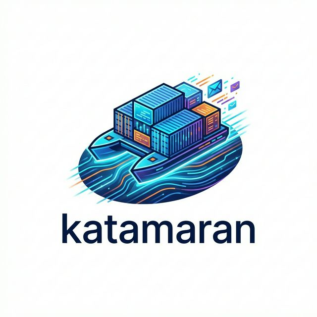
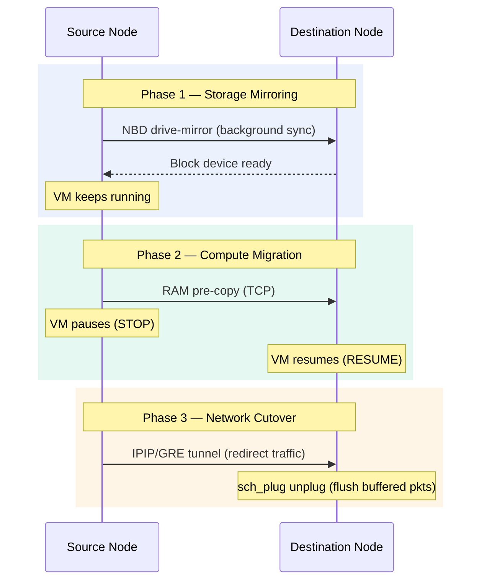
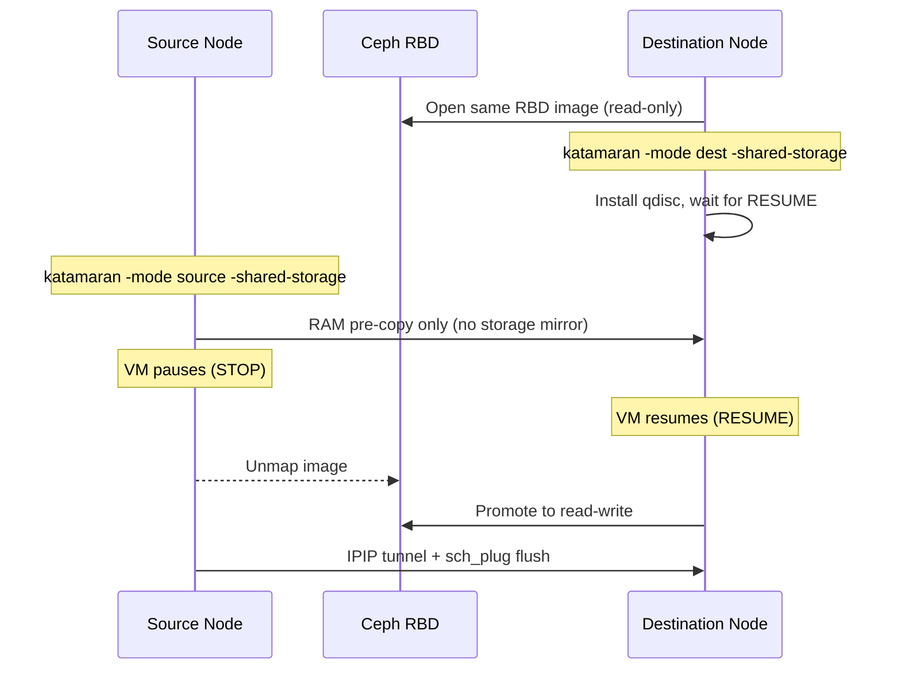
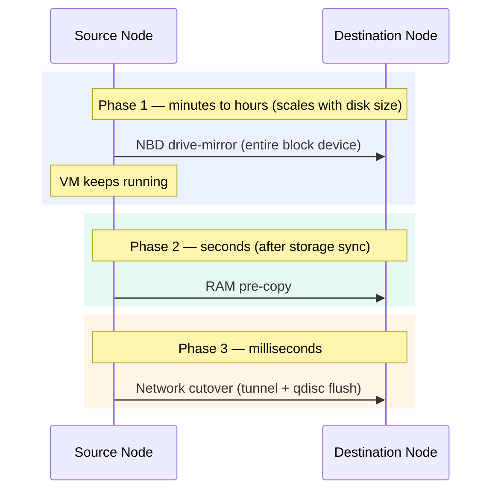
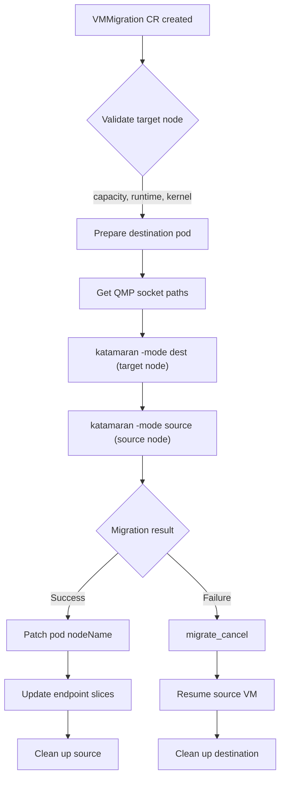

<div align="center">
  
  <h1>katamaran</h1>
  <p><b>Zero-drop live migration for Kata Containers</b></p>
</div>

Zero-packet-drop live migration for [Kata Containers](https://katacontainers.io/).

### Recent Updates

* **Correctness & Safety:** Fixed context cancellation data races and concurrent state access issues across all migration phases.

### TL;DR

```bash
make                # builds bin/katamaran

# Destination node (run first)
sudo ./bin/katamaran -mode dest -qmp /run/vc/vm/<id>/extra-monitor.sock -tap tap0_kata

# Source node
sudo ./bin/katamaran -mode source -qmp /run/vc/vm/<id>/extra-monitor.sock \
  -dest-ip <dest-node-ip> -vm-ip <pod-ip>
```

Three-phase migration: **storage** (NBD drive-mirror) → **compute** (RAM pre-copy) → **network** (IPIP/GRE tunnel + sch_plug qdisc). Packets arriving during the VM pause are buffered and flushed on resume — zero drops. Add `-shared-storage` with Ceph/NFS to skip the storage phase entirely.

---

Supports both **local storage** (NBD drive-mirror) and **shared storage** (Ceph, NFS — skip mirroring with `-shared-storage`).

Traditional QEMU live migration assumes shared storage. In Kubernetes with Kata Containers, pods typically use local virtio-blk disks — meaning the entire block device must be migrated alongside RAM and network state. `katamaran` orchestrates all three phases in the correct order while guaranteeing **zero in-flight packet drops** during the cutover.

> *Like a catamaran glides between two hulls, katamaran glides your VM between two nodes — smoothly, with nothing lost overboard.*

---

## Table of Contents
- [Getting Started](#getting-started)
- [Architecture Overview](#architecture-overview)
  - [Phase 1 — Storage Mirroring](#phase-1--storage-mirroring-nbd--drive-mirror)
  - [Phase 2 — Compute Migration](#phase-2--compute-migration-ram-pre-copy--final-incremental-copy)
  - [Phase 3 — Zero-Drop Network Cutover](#phase-3--zero-drop-network-cutover-tc-sch_plug--ip-tunnel)
- [Prerequisites](#prerequisites)
- [Project Structure](#project-structure)
- [Usage](#usage)
- [Why Sequential Pre-Copy?](#why-sequential-pre-copy)
- [Kubernetes Integration](#kubernetes-integration)
- [Dashboard](#dashboard)
- [Testing](#testing)

See also: **[Installation Guide](docs/INSTALL.md)** · **[Usage Guide](docs/USAGE.md)** · **[Testing Guide](docs/TESTING.md)** · **[User Stories](docs/STORIES.md)** · **[Dashboard](dashboard/README.md)**

---

## Getting Started

This section walks you through building katamaran, setting up a two-node cluster with Kata Containers, and running your first live migration — step by step.

### Tutorial Requirements

In addition to the [runtime prerequisites](#prerequisites) (QEMU 6.2+, Kata 3.x, iproute2, Go 1.22+), the tutorial requires:

- Linux host with KVM (`/dev/kvm` must exist)
- `minikube`, `kubectl`, `helm` installed
- `podman` (or Docker)
- ~30 GB free disk, ~20 GB free RAM (for two KVM nodes)

Verify KVM and nested virtualization:

```bash
ls /dev/kvm                                         # must exist
cat /sys/module/kvm_intel/parameters/nested          # Y or 1 (Intel)
cat /sys/module/kvm_amd/parameters/nested            # 1 (AMD)
```

### 1. Build katamaran

```bash
git clone https://github.com/maci0/katamaran.git
cd katamaran
make
./bin/katamaran -help
```

Run the smoke tests (no VMs required):

```bash
make smoke    # 66 tests, validates compilation, CLI behavior, project structure
```

### 2. Create a Two-Node Minikube Cluster

```bash
minikube start -p katamaran-demo \
  --nodes 2 \
  --driver=kvm2 \
  --memory=8192 \
  --cpus=4 \
  --container-runtime=containerd \
  --cni=calico

# Wait for both nodes to be ready
kubectl wait --for=condition=Ready node --all --timeout=120s
```

### 3. Install Kata Containers

```bash
helm upgrade --install kata-deploy \
  oci://ghcr.io/kata-containers/kata-deploy-charts/kata-deploy \
  --version 3.27.0 \
  --namespace kube-system \
  --create-namespace \
  --set shims.disableAll=true \
  --set shims.qemu.enabled=true \
  --wait=false

# Wait for kata-deploy to finish installing on both nodes
kubectl -n kube-system rollout status daemonset/kata-deploy --timeout=600s

# Verify the kata-qemu RuntimeClass exists
kubectl get runtimeclass kata-qemu
```

### 4. Deploy katamaran on Both Nodes

Build the container image and deploy via DaemonSet. This automatically installs the katamaran binary, enables the Kata QMP extra-monitor socket, and loads the required kernel modules (`ipip`, `ip6_tunnel`, `ip_gre`, `sch_plug`) on both nodes:

```bash
make image
minikube -p katamaran-demo image load katamaran.tar
kubectl apply -f deploy/daemonset.yaml
kubectl -n kube-system rollout status daemonset/katamaran-deploy --timeout=120s
```

### 5. Deploy a Test Workload

Instead of relying on an automated black-box script, let's deploy a Kata VM pod manually using the provided demo manifest:

```bash
kubectl apply -f demo/nginx-kata.yaml
```

Wait for the pod to become ready:

```bash
kubectl wait --for=condition=Ready pod/nginx-kata --timeout=60s
```

The manifest includes a NodePort service on port `30081`. You can test reaching the NGINX container directly from your host machine:

```bash
# Get the IP of the node
NODE_IP=$(kubectl get node katamaran-demo -o jsonpath='{.status.addresses[?(@.type=="InternalIP")].address}')
curl http://$NODE_IP:30081
```

*(Note: If you are using Docker Desktop on macOS/Windows, or if your hypervisor NAT doesn't bridge NodePorts directly, you can use `minikube service nginx-service --url` to create a localhost tunnel instead).*

### 6. Run the Migration via Kubernetes Jobs

To orchestrate the migration, katamaran uses two Kubernetes Jobs — one on the destination node and one on the source node. You apply these manifests manually, passing the required state through environment variables:

```bash
export POD_IP=$(kubectl get pod nginx-kata -o jsonpath='{.status.podIP}')
export DEST_IP=$(kubectl get node katamaran-demo-m02 -o jsonpath='{.status.addresses[?(@.type=="InternalIP")].address}')
export NODE_NAME="katamaran-demo-m02"
export IMAGE="localhost/katamaran:dev"
# Find the QMP sockets using the container runtime (crictl works for containerd/cri-o):
# export SRC_ID=$(minikube ssh -p katamaran-demo -n katamaran-demo -- sudo crictl pods --name nginx-kata -q)
export QMP_SOURCE="/run/vc/vm/<src-id>/extra-monitor.sock"

# export DEST_ID=$(minikube ssh -p katamaran-demo -n katamaran-demo-m02 -- sudo crictl pods --name nginx-kata-dest -q)
export QMP_DEST="/run/vc/vm/<dest-id>/extra-monitor.sock"

# Apply the jobs
envsubst < deploy/job-dest.yaml | kubectl apply -f -
envsubst < deploy/job-source.yaml | kubectl apply -f -
```

> [!WARNING]
> **This manual `kubectl apply` will fail out-of-the-box.** 
> Live migrating a Kata Container requires a destination QEMU process waiting with the exact same UUID, vsock, and hardware state as the source, started with the `-incoming` flag. 
> 
> In a production cluster, a dedicated **Kubernetes Operator** automates this complex state-matching phase before applying the katamaran jobs. 
> 
> To see the full end-to-end flow working in your local terminal (including the automated state-matching wrapper), use the provided E2E script:
> ```bash
> ./scripts/e2e.sh --provider minikube --ping-proof
> ```

> **Tip:** For a faster setup (~30s instead of ~5min), use Kind + Podman instead of minikube:
> ```bash
> ./scripts/e2e.sh --provider kind --ping-proof
> ./scripts/e2e.sh teardown --provider kind
> ```

---

## Architecture Overview

Migration proceeds in three sequential phases:


```mermaid
sequenceDiagram
    participant S as Source Node
    participant D as Destination Node

    rect rgb(59, 130, 246, 0.1)
    Note over S,D: Phase 1 — Storage Mirroring
    S->>D: NBD drive-mirror (background sync)
    D-->>S: Block device ready
    Note over S: VM keeps running
    end

    rect rgb(16, 185, 129, 0.1)
    Note over S,D: Phase 2 — Compute Migration
    S->>D: RAM pre-copy (TCP)
    Note over S: VM pauses (STOP)
    Note over D: VM resumes (RESUME)
    end

    rect rgb(245, 158, 11, 0.1)
    Note over S,D: Phase 3 — Network Cutover
    S->>D: IPIP/GRE tunnel (redirect traffic)
    Note over D: sch_plug unplug (flush buffered pkts)
    end
```

### Phase 1 — Storage Mirroring (NBD + drive-mirror)

The destination QEMU starts an NBD server exporting the target block device. The source issues a `drive-mirror` QMP command that copies every block to the remote NBD target in the background while the VM keeps running. Dirty blocks are re-synced continuously until the mirror reports `ready` (fully synchronized).

### Phase 2 — Compute Migration (RAM Pre-Copy & Final Incremental Copy)

Once storage is synchronized, the source starts standard QEMU RAM pre-copy migration (`migrate` QMP command) with `auto-converge` enabled. QEMU iteratively copies dirty RAM pages while the VM continues to run.

To achieve true "zero downtime" perception, `katamaran` explicitly configures QEMU with a strict **25ms downtime limit** and uncaps the migration bandwidth to 10GB/s. This forces QEMU to keep iterating until the remaining dirty RAM can be transferred in under 25 milliseconds.

Once the remaining dirty RAM set is small enough to transfer within this 25ms budget, the VM pauses (emitting the `STOP` event). **At this very last bit, QEMU performs a final incremental copy** of the remaining dirty RAM pages and in-flight storage blocks. Only after this final incremental copy completes does the destination VM resume (emitting the `RESUME` event).

### Phase 3 — Zero-Drop Network Cutover (tc sch_plug + IP Tunnel)

The critical downtime window — between `STOP` on the source and `RESUME` on the destination — is where packets would normally be lost. `katamaran` eliminates this:

1. **Source side**: Immediately after `STOP`, an IP tunnel is created pointing at the destination node. The tunnel encapsulation is selected by `-tunnel-mode`: with the default `ipip`, an IPIP tunnel is used for IPv4 (`mode ipip`) and an ip6tnl tunnel for IPv6 (`mode ip6ip6`); with `gre`, a GRE tunnel is used for IPv4 (`mode gre`) and an ip6gre tunnel for IPv6. GRE is recommended on cloud VPCs (AWS, GCP, Azure) where IPIP (IP protocol 4/41) is often blocked by security groups, while GRE (IP protocol 47) is widely permitted. A host route for the VM IP is added through the tunnel, forwarding any packets that arrive at the (now stale) source to the destination.
2. **Destination side**: A `tc sch_plug` qdisc on the destination tap interface buffers all arriving packets (including those forwarded through the tunnel). The qdisc is installed in pass-through mode (`release_indefinite`) and only switched to buffering (`block`) just before the expected RESUME. When the VM resumes, the queue is unplugged with `release_indefinite`, flushing all buffered packets into the now-running VM in order. QEMU's `announce-self` QMP command then broadcasts Gratuitous ARP using the guest's actual MAC address, ensuring switches learn the correct port binding immediately.

The result: packets that arrive during the switchover are queued, not dropped. After the CNI control plane converges (seconds later), new traffic flows directly to the destination and the tunnel is torn down.

### Concurrency, Safety & State Handling (Phase 1/2)

To ensure absolute safety during orchestration, `katamaran` implements strict concurrency constraints designed to avoid race conditions and resource leaks:

1. **Context Cancellation Trade-offs**: When the main context cancels (e.g. from `SIGINT` or a timeout), `katamaran` does *not* immediately close the QMP connection. Instead, it uses `context.AfterFunc` to shorten the socket deadline, cleanly interrupting any blocking reads without causing a data race. This keeps the QMP connection alive just long enough to execute deferred cleanup commands (like `migrate_cancel` or `block-job-cancel`) before exit.
2. **Cancellation-Detached Cleanup**: Operations running in `defer` blocks use `context.WithoutCancel`. This detaches the cleanup step from the main cancellation tree (so it isn't instantly aborted) but preserves critical values like logging traces or metrics attached to the original context.
3. **Sequential Polling vs Concurrent Races**: Instead of spawning background goroutines that listen for asynchronous QMP events while concurrently polling status endpoints, `katamaran` executes a unified sequential polling loop. This explicitly eliminates the risk of concurrent state access issues across all migration phases, avoiding missed `STOP` events or silent QEMU failures.

---

## Prerequisites

| Component | Minimum Version | Notes |
|-----------|----------------|-------|
| **QEMU** | 6.2+ | Must support `drive-mirror`, `nbd-server-start`, `announce-self`, QMP |
| **Kata Containers** | 3.x | QMP socket must be accessible |
| **iproute2** | any | `tc` (sch_plug qdisc) + `ip tunnel` (IPIP/GRE/ip6tnl/ip6gre) |
| **Go** | 1.22+ | Install system-wide |

For CNI compatibility details (OVN-Kubernetes, Cilium, Calico, Flannel, and others), see [Networking: CNI Compatibility](#networking-cni-compatibility) under Kubernetes Integration.

---

## Project Structure

```text
go.mod                          # Go module (github.com/maci0/katamaran)
Makefile                        # Build, test, fuzz, image targets
Dockerfile                      # Multi-stage container image build
Dockerfile.dashboard            # Dashboard container image build (multi-arch)
.dockerignore                   # Build context exclusions
cmd/
  katamaran/
    main.go                     # CLI entry point — flag parsing and dispatch
internal/
  migration/
    config.go                   # Constants, CleanupCtx, and RunCmd helper
    config_test.go              # Config unit tests and FuzzFormatQEMUHost
    dest.go                     # Destination-side migration logic
    dest_test.go                # Destination unit tests
    source.go                   # Source-side migration logic and polling
    source_test.go              # Source unit tests
    tunnel.go                   # IP tunnel setup/teardown (IPIP/GRE/ip6ip6/ip6gre)
    tunnel_test.go              # Tunnel unit tests
  qmp/
    client.go                   # QMP client (connect, execute, wait for events)
    client_test.go              # QMP client unit tests
    fuzz_test.go                # Fuzz tests for QMP protocol parsing (6 targets)
    types.go                    # QMP protocol types and command argument structs
dashboard/
  main.go                       # Dashboard web server (Go, stdlib only)
  index.html                    # Dashboard frontend (dark theme, Chart.js)
  dashboard.yaml                # Kubernetes Deployment + NodePort Service
  README.md                     # Dashboard usage guide
deploy/
  daemonset.yaml                # DaemonSet for node setup (binary, QMP config, kernel modules)
  job-dest.yaml                 # Job template for destination-side migration
  job-source.yaml               # Job template for source-side migration
  migrate.sh                    # Orchestration wrapper for Job-based migration
docs/
  INSTALL.md                    # Installation guide (binary, container, DaemonSet)
  USAGE.md                      # Usage guide (CLI and Kubernetes Jobs)
  TESTING.md                    # Test environment guide
  STORIES.md                    # User stories
  logo.png                      # Project logo
scripts/                        # Test and operational scripts
  test.sh                       # Smoke tests (no VMs required)
  cleanup.sh                    # Cluster cleanup helper
  minikube-test.sh              # Single-node Kata QMP smoke test (requires KVM)
  e2e.sh                        # Unified E2E live migration test harness
  manifests/                    # E2E test manifests and templates
    kata-pod.yaml               # Kata Containers pod template
    kind-config.yaml            # Kind cluster configuration
    kind-config-nocni.yaml      # Kind cluster configuration (CNI disabled for Cilium/Flannel)
    nfs-pv.yaml                 # NFS PersistentVolume template
    nfs-server.yaml             # NFS server pod template
    qemu-wrapper.sh             # QEMU state-matching wrapper for destination
```

---


## Usage

katamaran provides two modes (`source` and `dest`) to coordinate migration. 

For full details on CLI flags, direct usage, shared storage mode, IPv6, Cloud VPC configuration, and Kubernetes Job-based orchestration, please see the **[Usage Guide](docs/USAGE.md)**.


---

## Why Sequential Pre-Copy?

A natural question: *why not mirror storage and RAM in parallel?*

The `drive-mirror` operation generates substantial network I/O — it copies the **entire block device** (often tens of GB) over the wire. Running RAM pre-copy simultaneously would cause two problems:

1. **Buffer overflow on the network path.** Both streams compete for bandwidth. RAM pre-copy is latency-sensitive (dirty pages must be re-sent each round). When storage mirroring saturates the link, RAM rounds take longer, more pages get re-dirtied, and convergence stalls — or the migration fails entirely.
2. **Wasted bandwidth from redundant RAM retransmission.** While storage is still syncing, the VM keeps running and dirtying RAM. Each pre-copy round re-sends those dirty pages. If storage sync takes 5 minutes, that's 5 minutes of RAM rounds that will largely be invalidated. By waiting for storage to reach `ready`, we start RAM pre-copy on a quiet network with the shortest possible convergence path.

The sequential approach — storage first, then RAM — minimizes total migration time and keeps the final downtime window (the `STOP`→`RESUME` gap) as short as possible.

---

## Kubernetes Integration

`katamaran` is designed as a low-level migration primitive. In a production Kubernetes cluster, it would be invoked by a higher-level controller (e.g., a CRD operator) that orchestrates the full lifecycle: selecting a target node, preparing the destination VM, invoking `katamaran` on both sides, and updating Kubernetes state afterward.

This section explores which storage and networking stacks are compatible, what the ideal setup looks like, and the open integration points.

### Current Deployment Flow (DaemonSet + Jobs)

```mermaid
flowchart LR
    A[Build image localhost/katamaran:dev] --> B[Load image into cluster]
    B --> C[Apply deploy/daemonset.yaml]
    C --> D[/usr/local/bin/katamaran present on Kata nodes]
    D --> E[Create destination VM pod]
    E --> F[Detect QMP socket + tap iface]
    F --> G[Run deploy/migrate.sh]
    G --> H[Render job-dest.yaml via envsubst]
    H --> I[Wait dest job ready]
    I --> J[Render job-source.yaml via envsubst]
    J --> K[Wait source job complete]
    K --> L[Collect logs + migration result]
```

### Storage: CSI Driver Compatibility

The storage strategy depends on whether the cluster uses **shared storage** (both nodes see the same block device) or **local storage** (each node has its own disk).

| CSI Driver | Storage Type | katamaran Mode | Notes |
|-----------|-------------|-------------------|-------|
| **Ceph RBD** (`rbd.csi.ceph.com`) | Shared block | `-shared-storage` | Ideal. Both nodes mount the same RBD image. No data transfer needed — only RAM + network state migrate. Requires `ReadWriteMany` or controlled handoff (unmap on source, map on dest). |
| **CephFS** (`cephfs.csi.ceph.com`) | Shared filesystem | `-shared-storage` | Works if the VM's rootfs is on a CephFS-backed virtio-fs or virtiofs mount. Less common for block-level VM disks. |
| **NFS** (`nfs.csi.k8s.io`) | Shared filesystem | `-shared-storage` | Simple but slower. NFS latency can affect VM disk I/O during and after migration. Acceptable for low-IOPS workloads. |
| **Longhorn** (`driver.longhorn.io`) | Replicated local | NBD drive-mirror | Longhorn volumes are node-local with network replication. `katamaran` mirrors the block device via NBD, then the Longhorn controller can adopt the replica on the destination. |
| **OpenEBS Mayastor** (`io.openebs.csi-mayastor`) | Replicated local | NBD drive-mirror or `-shared-storage` | Mayastor NVMe-oF targets can be re-exported to the destination node, potentially allowing shared-storage mode. Otherwise, NBD drive-mirror works. |
| **TopoLVM** (`topolvm.io`) | Strict local | NBD drive-mirror | Purely local LVM. The entire block device must be mirrored. Best for small disks or infrequent migrations. |
| **Local Path Provisioner** | Strict local | NBD drive-mirror | No replication. Full block copy required. Suitable for dev/test. |

#### Shared Storage: The Fast Path

With Ceph RBD, migration skips the most time-consuming phase entirely. The flow becomes:


```mermaid
sequenceDiagram
    participant S as Source Node
    participant RBD as Ceph RBD
    participant D as Destination Node

    D->>RBD: Open same RBD image (read-only)
    Note over D: katamaran -mode dest -shared-storage
    D->>D: Install qdisc, wait for RESUME

    Note over S: katamaran -mode source -shared-storage
    S->>D: RAM pre-copy only (no storage mirror)
    Note over S: VM pauses (STOP)
    Note over D: VM resumes (RESUME)
    S-->>RBD: Unmap image
    D->>RBD: Promote to read-write
    S->>D: IPIP tunnel + sch_plug flush
```

Total migration time is dominated by RAM pre-copy convergence — typically **seconds** for a 4 GB VM with moderate dirty page rate.

#### Local Storage: The Full Pipeline

With Longhorn or local disks, all three phases run:


```mermaid
sequenceDiagram
    participant S as Source Node
    participant D as Destination Node

    rect rgb(59, 130, 246, 0.1)
    Note over S,D: Phase 1 — minutes to hours (scales with disk size)
    S->>D: NBD drive-mirror (entire block device)
    Note over S: VM keeps running
    end

    rect rgb(16, 185, 129, 0.1)
    Note over S,D: Phase 2 — seconds (after storage sync)
    S->>D: RAM pre-copy
    end

    rect rgb(245, 158, 11, 0.1)
    Note over S,D: Phase 3 — milliseconds
    S->>D: Network cutover (tunnel + qdisc flush)
    end
```

The NBD mirror runs in the background while the VM stays live, but total wall-clock time scales with disk size and write rate.

### Networking: CNI Compatibility

The network cutover (Phase 3) must work with the cluster's CNI plugin. The key requirement is that **the VM's pod IP must remain reachable** during the gap between source STOP and destination RESUME, plus the time for the CNI to update its routing/forwarding tables.

| CNI | Compatibility | How It Works | Convergence Time |
|-----|--------------|-------------|-----------------|
| **OVN-Kubernetes** | ★★★ Excellent | OVN's southbound DB updates the port-chassis binding. The logical switch port moves to the destination node automatically. GARP + OVN's own MAC learning provide near-instant convergence. Tested via `e2e.sh --cni ovn`. | < 1s |
| **Kube-OVN** | ★★★ Excellent | Separate OVN-based CNI (by Alauda). Same port-chassis rebinding via OVN southbound DB. Additional features like subnets and VPCs. Not tested but expected to work identically. | < 1s |
| **Cilium** | ★★★ Excellent | eBPF datapath. After migration, the destination node's Cilium agent detects the new endpoint and installs eBPF maps. The IPIP tunnel covers the gap. Cilium's IPAM can be configured to preserve pod IPs across nodes with `cluster-pool` mode. | 1–3s |
| **Calico** | ★★☆ Good | BGP route propagation. The destination node advertises the pod IP via BGP. The IPIP tunnel bridges the gap until all peers converge. Calico IPAM must allow the pod IP to exist on the destination node (use `--ipam=host-local` with a shared pool, not per-node blocks). | 2–5s |
| **Flannel** | ★★☆ Good | VXLAN FDB entries. The destination node must update the VXLAN forwarding database. GARP handles L2, but Flannel's `flanneld` may take a few seconds to update FDB entries on all nodes. The IPIP tunnel covers the gap. | 2–5s |
| **Antrea** | ★★☆ Good | OVS-based. Similar to OVN-Kubernetes but with its own controller. Port migration requires the Antrea agent to update OVS flows on the destination. GARP + IP tunnel cover the gap. | 1–3s |
| **Multus** (meta-CNI) | Depends | Multus delegates to underlying CNIs. Compatibility depends on the primary and secondary CNI plugins. Each interface may need its own migration strategy. | Varies |

#### IP Preservation

> [!IMPORTANT]
> The most critical requirement for network routing is that **the VM's pod IP must survive migration**.

This means:
- The IPAM must allow the same IP to be assigned on the destination node
- Per-node IP blocks (Calico's default) are problematic — the pod IP belongs to the source node's CIDR
- Solutions: cluster-wide IPAM pools, static IP annotation, or a migration-aware IPAM plugin

### The Ideal Setup

For production live migration with minimal downtime and operational complexity:

```text
┌─────────────────────────────────────────────────────┐
│                  Ideal Stack                         │
├──────────────┬──────────────────────────────────────┤
│ Runtime      │ Kata Containers 3.x + Cloud Hypervisor or QEMU 8+ │
│ Storage CSI  │ Ceph RBD (rbd.csi.ceph.com)          │
│ Storage Mode │ -shared-storage (skip NBD mirror)     │
│ CNI          │ OVN-Kubernetes or Cilium              │
│ IPAM         │ Cluster-wide pool (not per-node)      │
│ Kernel       │ 5.15+ (sch_plug, IPIP, KVM)           │
│ Network      │ 25 Gbps+ node-to-node (for RAM pre-copy) │
│ Orchestrator │ CRD operator (manages lifecycle)      │
└──────────────┴──────────────────────────────────────┘
```

**Why this stack:**
1. **Ceph RBD** eliminates the storage mirroring phase entirely. Migration becomes RAM-only, completing in seconds instead of minutes.
2. **OVN-Kubernetes or Cilium** provide the fastest network convergence. OVN's centralized southbound DB updates port bindings atomically. Cilium's eBPF datapath reconverges without waiting for BGP propagation.
3. **Cluster-wide IPAM** ensures the pod IP is valid on any node, avoiding the per-node CIDR problem.
4. **25 Gbps+ networking** ensures the final dirty page flush (the actual downtime-causing transfer) completes well within the 25ms budget.

### Integration Architecture (Operator-Driven)

A Kubernetes operator would manage migration as a CRD:

```yaml
apiVersion: katamaran.io/v1alpha1
kind: VMMigration
metadata:
  name: migrate-nginx-pod
spec:
  podName: nginx-kata-7b4f8c
  targetNode: worker-02
  strategy: live
  sharedStorage: true
  timeout: 300s
```

The operator's reconciliation loop:


```mermaid
flowchart TD
    A[VMMigration CR created] --> B{Validate target node}
    B -->|capacity, runtime, kernel| C[Prepare destination pod]
    C --> D[Get QMP socket paths]
    D --> E["katamaran -mode dest (target node)"]
    E --> F["katamaran -mode source (source node)"]
    F --> G{Migration result}
    G -->|Success| H[Patch pod nodeName]
    H --> I[Update endpoint slices]
    I --> J[Clean up source]
    G -->|Failure| K[migrate_cancel]
    K --> L[Resume source VM]
    L --> M[Clean up destination]
```

### Open Questions for Production

- **Pod checkpoint/restore**: Should the operator snapshot the pod spec and container state for rollback?
- **Multi-disk VMs**: katamaran currently mirrors a single drive. Multi-disk setups would need parallel NBD mirrors or sequential mirroring.
- **Live migration scheduling**: Which node to pick? Factors: resource headroom, storage locality, network topology, anti-affinity rules.
- **Preemption**: Can a migration be preempted mid-flight if the destination node runs out of resources? This requires `migrate_cancel` QMP support (already available in QEMU).
- **Encryption**: NBD traffic and RAM migration traffic are currently unencrypted. For cross-rack or cross-AZ migration, WireGuard or IPsec tunnels should wrap the migration streams.
- **Observability**: Exposing migration progress (storage sync %, RAM dirty rate, downtime duration) as Prometheus metrics via the operator.

---

## Dashboard

A web UI for orchestrating migrations, visualizing ping latency (zero-drop proof), and running HTTP load generators during cutover. See [dashboard/README.md](dashboard/README.md) for details.

### Deploying the Dashboard

```bash
# 1. Build the image (from repository root)
make dashboard

# 2. Load it into your cluster (if using minikube/kind)
minikube image load dashboard.tar

# 3. Deploy the manifests
kubectl apply -f dashboard/dashboard.yaml
```

### Using the Dashboard

Once deployed, the dashboard is exposed via a NodePort service on port `30080`.

1. **Access the UI**: Open your browser to `http://<node-ip>:30080` (or run `minikube service katamaran-dashboard -n kube-system --url` to get the direct link).
2. **Configure Migration**: Enter your source/destination node names, QMP socket paths, and the VM pod IP into the form.
3. **Start Load Generation**: Enter the pod's IP in the Ping/HTTP target box and click **Start**. A live Chart.js graph will begin plotting latency.
4. **Migrate**: Click **Migrate**. The real-time log viewer will stream the orchestrator's progress.
5. **Observe Zero-Drop**: As the migration crosses the critical 25ms downtime window, you will see a latency spike on the chart (representing the buffered packets) but zero dropped packets!

---

## Testing

katamaran includes a comprehensive test suite ranging from native Go fuzzing to multi-node live migration tests proving zero packet drops across various CNIs (OVN-Kubernetes, Cilium, Calico, Flannel) and storage backends.

For instructions on running the test suite, verifying zero-drop behavior, and fuzzing the QMP protocol, please see the **[Testing Guide](docs/TESTING.md)**.