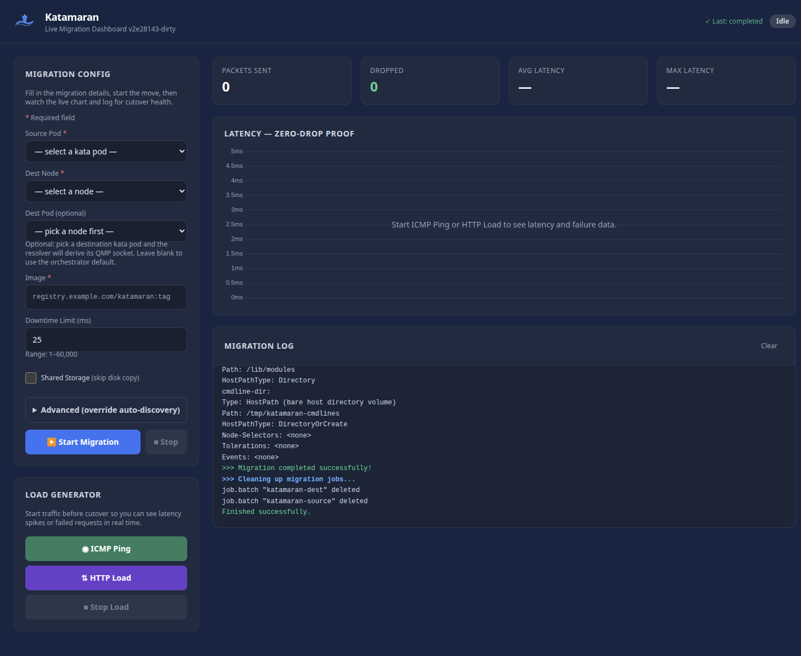
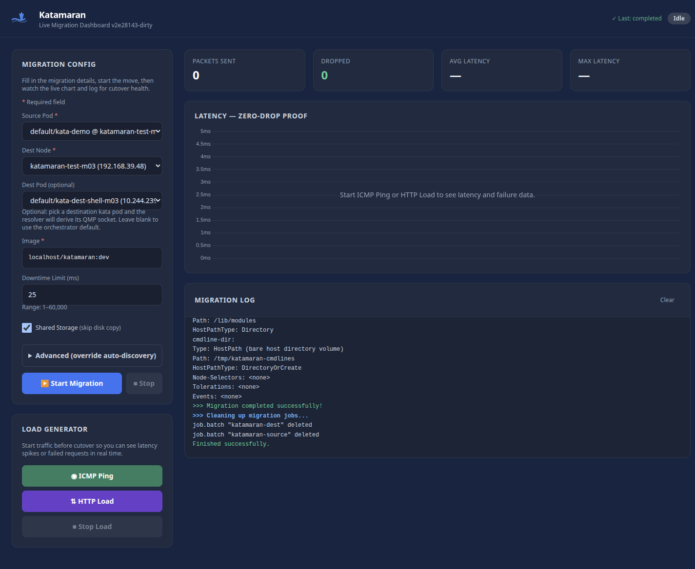
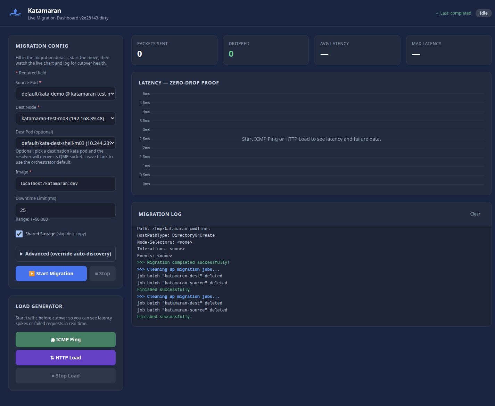
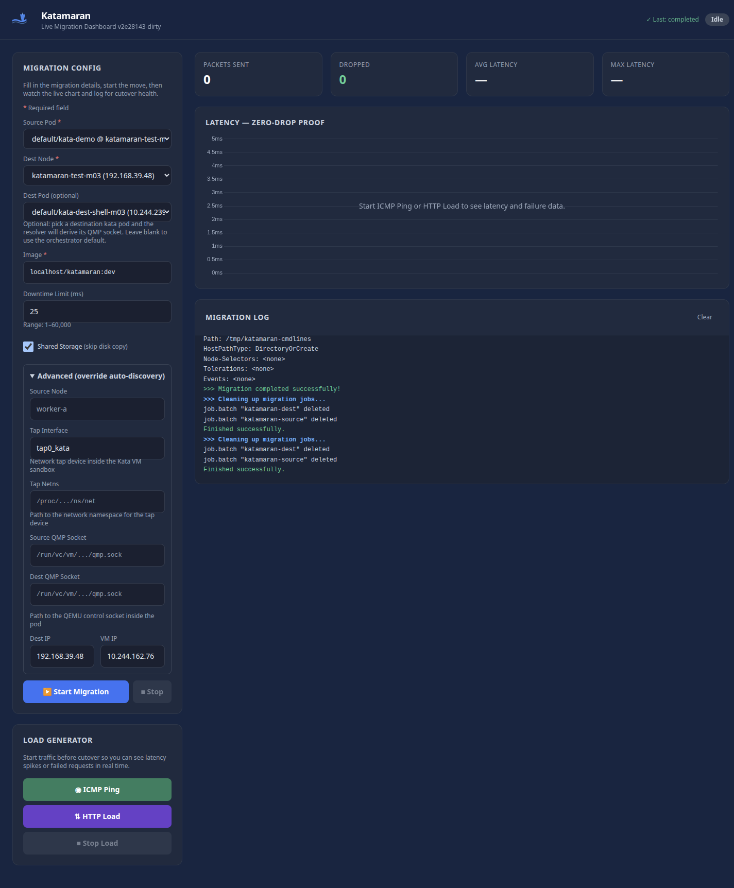
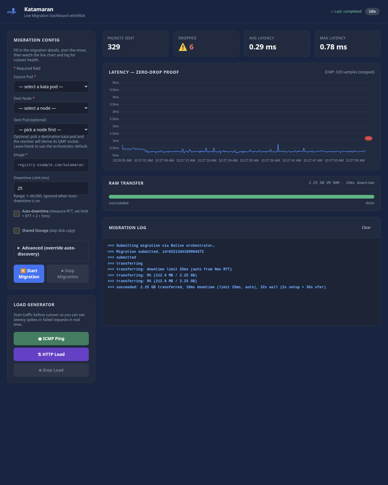
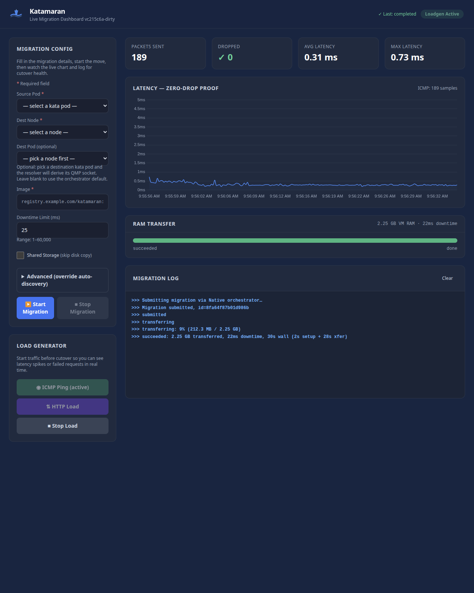

# Katamaran Dashboard

A web UI for orchestrating katamaran live migrations, visualizing ping latency (zero-drop proof), and running load generators during cutover.



## Features

- **Pod-picker UX** — pick a kata-qemu source pod and destination node from dropdowns; backend resolves sandbox UUID, QEMU PID, pod IP, and node IP automatically. Optional dest-pod picker for symmetric resolution.
- **Cmdline replay (zero-config dest)** — when `replay_cmdline=true` is set, the dashboard captures the source QEMU command line and replays it on the destination node with `-incoming defer`. The dest sandbox is spawned by katamaran itself.
- **Advanced override pane** — every auto-derived value (QMP socket paths, tap interface, netns, dest IP, VM IP) is editable. Leave blank for auto, fill in to override.
- **Migration orchestration** — fill in source/destination details (or pick from dropdowns) and submit. The dashboard runs migrations through the in-cluster Native orchestrator (client-go); it no longer shells out to `deploy/migrate.sh`.
- **RAM transfer progress bar** — live `submitted → transferring → succeeded` widget driven by `KATAMARAN_PROGRESS` markers tailed from the source pod. Shows percent, transferred/total bytes, then collapses to a green "done" bar with the actual VM downtime once the dest job completes.
- **Auto-downtime** — checkbox in the migration form. When set, the source binary measures network RTT to the destination via ICMP echo and programs the QEMU downtime limit as `max(rtt × 2 + 25ms, 25ms)`. The chosen limit is logged before the cutover (`>>> transferring: downtime limit 25ms (auto from 0ms RTT)`) and recapped on the success line.
- **Ping latency chart** — real-time Chart.js graph showing per-packet latency; buffered packets during cutover appear as RTT spikes.
- **HTTP load generator** — continuous HTTP GET requests to a target, graphed alongside ping data.
- **Live stats** — packets transmitted, dropped, average latency, max latency (computed from ping data).
- **Color-coded log viewer** — red for errors, amber for warnings, green for success, blue for `>>>` markers; auto-scrolls with new entries. Final succeeded line includes wall-clock + setup/xfer breakdown, e.g. `>>> succeeded: 2.25 GB transferred, 27ms downtime, 30s wall (2s setup + 28s xfer)`.
- **Status badges** — idle (gray), migration running (blue pulse), loadgen active (green pulse).
- **Dark theme** — navy/slate backgrounds with SVG katamaran boat + animated wave header.

## Screenshots

| Initial view | Pod picker filled | Migration completed | Advanced overrides |
|--------------|-------------------|---------------------|---------------------|
|  |  |  |  |

| RAM transfer in flight | Migration completed (progress widget) |
|------------------------|---------------------------------------|
|  |  |

## API Endpoints

| Endpoint | Method | Description |
|----------|--------|-------------|
| `/healthz` | GET | Kubernetes liveness probe (lightweight, always returns 200 OK) |
| `/readyz` | GET | Kubernetes readiness probe (returns 200 once a Native orchestrator is wired, 503 otherwise) |
| `/` | GET | Dashboard frontend |
| `/api/pods` | GET | List of `kata-qemu` pods cluster-wide: `[{namespace, name, node, pod_ip}]`. Backs the Source Pod and Dest Pod dropdowns. |
| `/api/nodes` | GET | List of nodes labeled `katacontainers.io/kata-runtime=true`: `[{name, internal_ip}]`. Backs the Dest Node dropdown. |
| `/api/migrate` | POST | Start migration. Pod-picker form fields: `source_pod_namespace`, `source_pod_name`, `dest_node`, `dest_pod_namespace` (opt), `dest_pod_name` (opt), `image`, `downtime`, `auto_downtime`, `shared_storage`, `replay_cmdline`, `tunnel_mode`. Legacy explicit form fields are still accepted: `source_node`, `dest_node`, `qmp_source`, `qmp_dest`, `tap`, `tap_netns`, `dest_ip`, `vm_ip`, `image`, `shared_storage`, `downtime`, `auto_downtime`, `tunnel_mode`. |
| `/api/migrate/stop` | POST | Cancel running migration |
| `/api/status` | GET | JSON status for the UI, including migration state, counters, `history`, `logs`, `logs_next`, `logs_reset`, `pings`, `pings_next`, and `pings_reset`. Accepts `logs_after` and `pings_after` cursors for incremental polling. `migration_progress` is `{phase, ram_transferred, ram_total, downtime_ms}` while a migration is running and after it completes (until the next run starts). |
| `/api/history` | GET | Completed migrations, newest first |
| `/api/ping` | POST | Start continuous ping (5/sec) to target. Accepts `target=<host-or-ip>` via form body or query string. |
| `/api/ping/stop` | POST | Stop active ping/loadgen |
| `/api/httpgen` | POST | Start HTTP load generator (5 req/sec) to target. Accepts `target=<host-or-ip[:port]>` via form body or query string. |
| `/api/httpgen/stop` | POST | Stop active ping/loadgen |
| `/metrics` | GET | Prometheus text-format operational metrics |
| `/debug/pprof/` | GET | Runtime profiling (requires `--enable-debug`) |
| `/debug/vars` | GET | Runtime metrics via expvar (requires `--enable-debug`) |

API conventions:

- State-changing `/api/*` endpoints accept `application/x-www-form-urlencoded` request bodies. Empty-body calls may pass parameters in the query string only where the endpoint description says so.
- JSON responses set `Cache-Control: no-store`; errors use `{"error":"..."}` and may include endpoint-specific fields such as `migration_id`, `loadgen_type`, or `allow`.
- Unknown form fields are rejected with `400 Bad Request` so typos do not silently run a migration with defaulted values.

## Pod-picker workflow (recommended)

1. Open the dashboard. The two `<select>` dropdowns auto-populate from `GET /api/pods` (filtered to `runtimeClassName=kata-qemu`) and `GET /api/nodes` (filtered to label `katacontainers.io/kata-runtime=true`).
2. Pick **Source Pod**: `<namespace>/<name> @ <node> (<pod-ip>)`. The hidden `vm_ip` field auto-fills with the pod IP.
3. Pick **Dest Node**: `<name> (<internal-ip>)`. The hidden `dest_ip` field auto-fills. The source's own node is hidden from the dest list.
4. Optional: pick **Dest Pod** when you want the destination job to connect to an existing kata sandbox. With `replay_cmdline=true`, leave it blank and katamaran spawns the destination QEMU itself.
5. Set **Image** (e.g., `localhost/katamaran:dev`) and click **Start Migration**.

The source job's resolver finds the QEMU PID and sandbox UUID at runtime (via the in-cluster apiserver) and assembles the rest of the migration arguments. Logs stream live into the Migration Log panel.

## Scripted invocation (curl)

```bash
curl -sS -X POST http://127.0.0.1:8080/api/migrate \
  -d "source_pod_namespace=default" \
  -d "source_pod_name=kata-demo" \
  -d "dest_node=worker-b" \
  -d "image=localhost/katamaran:dev" \
  -d "downtime=25" \
  -d "shared_storage=true" \
  -d "replay_cmdline=true"
```

## Building the Container

From the repository root:

```bash
make dashboard
```

The Dockerfile supports multi-arch builds via `TARGETARCH` (defaults to `amd64`). To build for `arm64`:

```bash
podman build --platform linux/arm64 -t localhost/katamaran-dashboard:dev -f Dockerfile.dashboard .
```

## Running Locally (Docker/Podman)

```bash
podman run -d --rm -p 8080:8080 \
  -e KUBECONFIG=/home/dashboard/.kube/config \
  -v $HOME/.kube/config:/home/dashboard/.kube/config:ro \
  --network host \
  localhost/katamaran-dashboard:dev
```

Then visit http://localhost:8080

> **Note:** `--network host` is required so the dashboard can reach the Kubernetes API and migration targets. The kubeconfig mount is needed for the Native orchestrator's client-go calls when running outside the cluster; in-cluster pods use the mounted ServiceAccount instead.

## Running In-Cluster

```bash
kubectl apply -f deploy/dashboard.yaml
```

This creates:
- A `ServiceAccount` with RBAC permissions to manage Jobs and read pod logs
- A `Deployment` running the dashboard container
- A `ClusterIP` Service on port **8080**

Access the dashboard via `kubectl port-forward -n kube-system svc/katamaran-dashboard 8080:8080`, then open `http://localhost:8080`.

## Architecture

```text
┌─────────────────────────────────────────────┐
│  Browser (index.html + Chart.js)            │
│  Polls /api/status every 1s                 │
└──────────────┬──────────────────────────────┘
               │ HTTP
┌──────────────▼──────────────────────────────┐
│  Go HTTP server (internal/dashboard)        │
│  - /api/migrate → Native orchestrator       │
│       └─ client-go: submit src + dest Jobs  │
│       └─ tail src pod log for KATAMARAN_*   │
│  - /api/ping    → exec ping subprocess      │
│  - /api/httpgen → HTTP GET loop             │
│  - /api/status  → JSON {logs, pings,        │
│                          progress, state}   │
└─────────────────────────────────────────────┘
```

The HTTP layer uses the Go standard library; Kubernetes orchestration and discovery are handled through client-go. The server uses graceful shutdown via `signal.NotifyContext`, HTTP server timeouts, and context-based cancellation for child processes.
