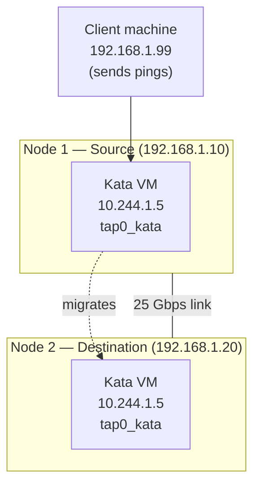
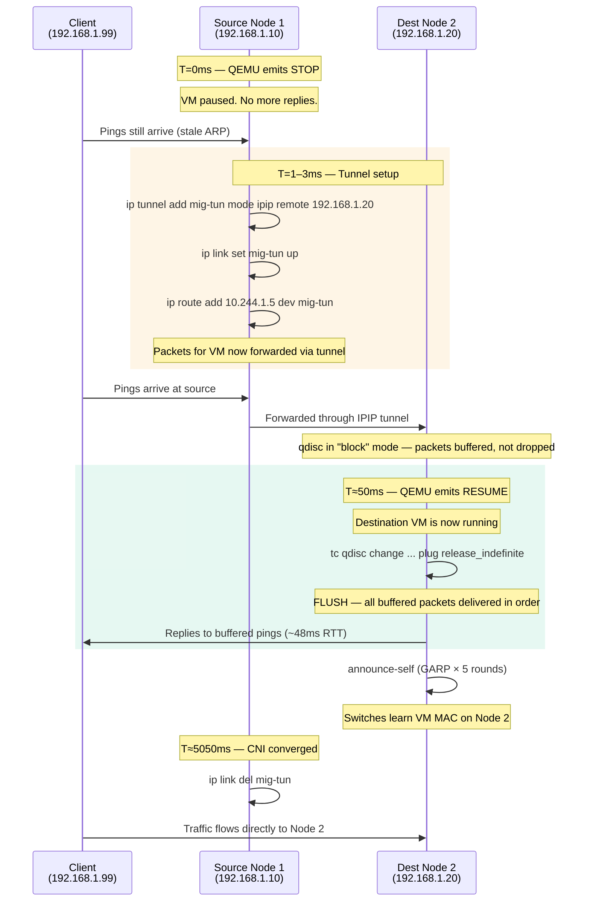

# Testing Guide

### TL;DR

```bash
./testenv/test.sh                  # smoke tests — no VMs, no KVM, runs anywhere
./testenv/minikube-e2e.sh          # two-node live migration (Calico CNI)
./testenv/minikube-ovn-e2e.sh      # two-node + zero-drop proof (OVN-Kubernetes)
./testenv/minikube-nfs-e2e.sh      # two-node + NFS shared storage + zero-drop proof
./testenv/kind-e2e.sh              # two-node + zero-drop proof (Kind + Podman)
```

All E2E tests need a Linux host with KVM and nested virtualization. Smoke tests run anywhere with Go 1.22+.

---

All test environments use minikube with KVM. No manual QEMU VM provisioning is needed.

## Table of Contents
- [Prerequisites](#prerequisites)
  - [Verify Nested Virtualization](#verify-nested-virtualization)
- [1. Smoke Tests (No VMs Required)](#1-smoke-tests-no-vms-required)
- [2. Minikube Smoke Test (Single-Node, Real QMP)](#2-minikube-smoke-test-single-node-real-qmp)
- [3. Two-Node E2E Migration Test](#3-two-node-e2e-migration-test)
- [4. Zero-Packet-Drop Proof — Full Worked Example](#4-zero-packet-drop-proof--full-worked-example)
- [5. OVN-Kubernetes E2E Migration Test (Two-Node, Zero-Drop Proof)](#5-ovn-kubernetes-e2e-migration-test-two-node-zero-drop-proof)
- [6. Kind + Podman E2E Migration Test (Two-Node, Zero-Drop Proof)](#6-kind--podman-e2e-migration-test-two-node-zero-drop-proof)
- [Troubleshooting](#troubleshooting)

## Prerequisites

- Linux host with KVM support (`/dev/kvm` must exist)
- Nested virtualization enabled (required for Kata Containers inside minikube)
- Go 1.22+ (install system-wide)

### Verify Nested Virtualization

```bash
# Intel
cat /sys/module/kvm_intel/parameters/nested   # should print Y or 1

# AMD
cat /sys/module/kvm_amd/parameters/nested     # should print 1
```

## 1. Smoke Tests (No VMs Required)

Validates Go source quality and CLI behavior without any VMs:

```bash
./testenv/test.sh
```

This validates:
- Go source compiles cleanly (`go vet` + `gofmt` + `go build`)
- Binary rejects invalid invocations (missing flags, bad socket, unexpected args, invalid mode)
- Invalid mode produces a specific error message (not just generic usage)
- Source mode missing-flags error mentions `-dest-ip` and `-vm-ip` specifically
- Dest mode QMP error mentions the socket path for debuggability
- Empty mode prints a "Usage" message
- `-help` flag prints descriptions for all seven flags
- `-shared-storage` flag combinations work correctly
- Invalid IP addresses for `-dest-ip` and `-vm-ip` are rejected with specific error messages
- Valid IP addresses pass validation (fail later at QMP connect, not at validation)
- Shell scripts have valid syntax
- Required project files exist

## 2. Minikube Smoke Test (Single-Node, Real QMP)

Validates katamaran against a real Kata Containers QMP socket inside a single-node minikube cluster.

### Additional Prerequisites

- `minikube`, `kubectl`, `helm` installed
- ~20 GB free disk space, ~16 GB free RAM
- katamaran binary built (`go build -o katamaran ./cmd/katamaran/`)

### Run

```bash
./testenv/minikube-test.sh          # auto-cleans up after
./testenv/minikube-test.sh --keep   # keep cluster for debugging
```

The script:
1. Starts a minikube cluster (KVM2 driver, containerd)
2. Installs Kata Containers via `kata-deploy` Helm chart
3. Enables the extra QMP monitor socket in the Kata configuration
4. Deploys an `nginx:alpine` pod with `runtimeClassName: kata-qemu`
5. Copies katamaran into the minikube node
6. Locates the Kata QMP socket and runs katamaran in dest mode to validate the QMP handshake
7. Tests CLI behavior (invalid mode, usage output)

### What This Validates

- katamaran binary runs correctly on a real Kubernetes node
- QMP socket discovery works with Kata's runtime directory layout
- QMP handshake succeeds with a live Kata VM (proves `NewQMPClient` + `qmp_capabilities` work end-to-end)
- CLI error handling works in-situ

### What This Does NOT Test

- Actual live migration (requires two nodes)
- Network cutover (IPIP tunnel, sch_plug qdisc)
- Storage mirroring (NBD drive-mirror)

## 3. Two-Node E2E Migration Test

Creates a two-node minikube cluster, installs Kata Containers on both nodes, and runs a full live migration using katamaran.

### Additional Prerequisites

- Same as the single-node smoke test
- ~30 GB free disk space, ~20 GB free RAM (two KVM nodes)

### Run

```bash
./testenv/minikube-e2e.sh           # run full e2e, clean up on exit
./testenv/minikube-e2e.sh teardown  # destroy cluster only
```

The script:
1. Creates a 2-node minikube cluster (KVM2 driver, Calico CNI)
2. Installs Kata Containers via Helm on both nodes
3. Enables the extra QMP monitor socket on both nodes
4. Copies the katamaran binary to both nodes
5. Deploys a source pod on Node 1 with `runtimeClassName: kata-qemu`
6. Extracts QEMU state (UUID, vsock, chardev) from the source VM
7. Installs a state-matching QEMU wrapper on Node 2 (so the destination VM accepts the incoming migration)
8. Deploys a destination pod on Node 2
9. Runs katamaran in dest mode on Node 2, then source mode on Node 1
10. Reports migration results and destination logs

### What This Validates

- Full live migration pipeline (RAM pre-copy with auto-converge)
- QMP handshake and command execution on both nodes
- Migration state matching between source and destination QEMU instances
- Graceful cleanup on success and failure

## 4. Zero-Packet-Drop Proof — Full Worked Example

This section documents a complete end-to-end live migration with continuous traffic, proving that **zero packets are dropped** during the VM cutover. Every command, its expected output, and the verification steps are shown.

### Topology



- **VM pod IP**: `10.244.1.5` (stays the same after migration)
- **Source node**: `192.168.1.10` (Node 1)
- **Destination node**: `192.168.1.20` (Node 2)
- **Client**: `192.168.1.99` (any machine that can reach the pod IP)

### Prerequisites

- Two-node Kubernetes cluster with Kata Containers installed
- `sch_plug` kernel module loaded on Node 2 (`modprobe sch_plug`)
- `ipip` kernel module loaded on Node 1 (`modprobe ipip`)
- katamaran binary on both nodes at `/usr/local/bin/katamaran`
- QMP extra-monitor socket enabled in Kata configuration
- Shared storage (Ceph RBD) or local storage (the example below uses shared storage for brevity; with local storage, add the NBD drive-mirror phase)

### Step 0: Identify the QMP Sockets and Tap Interface

On each node, find the Kata sandbox's QMP socket:

```bash
# Node 1 (source)
node1$ sudo find /run/vc -name "extra-monitor.sock"
/run/vc/vm/abc123def456/extra-monitor.sock

# Node 2 (destination) — after the destination pod is created
node2$ sudo find /run/vc -name "extra-monitor.sock"
/run/vc/vm/789xyz000111/extra-monitor.sock
```

On Node 2, identify the tap interface for the destination VM:

```bash
node2$ ip -br link | grep tap
tap0_kata        UP             fe:ab:cd:12:34:56
```

### Step 1: Start the Continuous Ping (Proof Mechanism)

From the client machine, start a flood ping to the VM's pod IP. This runs throughout the entire migration. The `-i 0.01` flag sends one ping every 10ms (100 pings/sec), which is aggressive enough to catch any gap.

```bash
client$ ping -i 0.01 -c 10000 -D 10.244.1.5 | tee /tmp/ping-during-migration.log
```

Expected output (begins immediately, continues during migration):

```text
PING 10.244.1.5 (10.244.1.5) 56(84) bytes of data.
[1708886400.000001] 64 bytes from 10.244.1.5: icmp_seq=1 ttl=64 time=0.412 ms
[1708886400.010002] 64 bytes from 10.244.1.5: icmp_seq=2 ttl=64 time=0.389 ms
[1708886400.020003] 64 bytes from 10.244.1.5: icmp_seq=3 ttl=64 time=0.401 ms
...
```

Leave this running in its own terminal. We will check the final summary after migration completes.

### Step 2: (Optional) Start a tcpdump on Node 1 to Observe Tunnel Forwarding

This is optional but provides visual proof that packets arriving at the source after STOP are forwarded through the IPIP tunnel to the destination.

```bash
node1$ sudo tcpdump -i mig-tun -nn -c 50 2>&1 | tee /tmp/tunnel-capture.log &
```

This will capture packets on the `mig-tun` tunnel interface once it is created in Step 5.

### Step 3: Start katamaran on the Destination (Node 2)

Run the destination side first. It installs the `sch_plug` qdisc, connects to QMP, and waits for the incoming migration.

```bash
node2$ sudo katamaran \
  -mode dest \
  -qmp /run/vc/vm/789xyz000111/extra-monitor.sock \
  -tap tap0_kata \
  -shared-storage
```

Expected output (destination blocks at "Waiting for QEMU RESUME event..."):

```text
2026/02/26 04:30:01 Preparing network queue on tap0_kata...
2026/02/26 04:30:01 Network queue installed (pass-through, not plugged yet).
2026/02/26 04:30:01 Shared storage mode: skipping NBD server setup.
2026/02/26 04:30:01 Network queue plugged. Buffering in-flight packets...
2026/02/26 04:30:01 Waiting for QEMU RESUME event...
```

**What happened so far on Node 2:**

| Step | Command | Effect |
|------|---------|--------|
| 1a | `tc qdisc add dev tap0_kata root plug limit 32768` | Install sch_plug qdisc |
| 1b | `tc qdisc change dev tap0_kata root plug release_indefinite` | Set to pass-through (traffic flows normally) |
| 3 | `tc qdisc change dev tap0_kata root plug block` | Switch to buffering mode — all arriving packets are queued |

At this point, any packets that arrive at the destination's tap interface are **buffered in the kernel**, not dropped and not delivered. The destination is ready.

### Step 4: Start katamaran on the Source (Node 1)

```bash
node1$ sudo katamaran \
  -mode source \
  -qmp /run/vc/vm/abc123def456/extra-monitor.sock \
  -dest-ip 192.168.1.20 \
  -vm-ip 10.244.1.5 \
  -shared-storage
```

Expected output (with `-shared-storage`, phases 1-2 are skipped):

```text
2026/02/26 04:30:05 Starting live migration to 192.168.1.20...
2026/02/26 04:30:05 Shared storage mode: skipping drive-mirror.
2026/02/26 04:30:05 Configuring RAM migration...
2026/02/26 04:30:05 RAM migration started. Waiting for VM to pause (STOP event)...
2026/02/26 04:30:08 VM paused. Redirecting in-flight packets to destination...
2026/02/26 04:30:08 IP tunnel established. Traffic redirected.
2026/02/26 04:30:08 Waiting for migration to complete...
2026/02/26 04:30:08 Migration status: active
2026/02/26 04:30:09 Migration status: completed
2026/02/26 04:30:09 Waiting 5s for CNI convergence before removing tunnel...
2026/02/26 04:30:14 Source cleanup complete. Migration succeeded.
```

### Step 5: What Happened During the Critical Window

The critical zero-drop window is the ~50ms between `STOP` (source VM pauses) and `RESUME` (destination VM starts). Here is the exact sequence and what katamaran did at each moment:



Meanwhile, on the destination side, the output completes:

```text
2026/02/26 04:30:08 VM resumed. Flushing buffered packets...
2026/02/26 04:30:08 Queue unplugged. Buffered packets delivered. Zero drops achieved.
2026/02/26 04:30:08 Broadcasting Gratuitous ARP via QEMU announce-self...
2026/02/26 04:30:08 GARP announce-self scheduled (5 rounds).
2026/02/26 04:30:08 Destination setup complete.
```

### Step 6: Check the Ping Results (THE PROOF)

After migration completes, stop the ping on the client (`Ctrl+C`) and examine the summary:

```bash
client$ # (ping finishes or Ctrl+C)
```

Expected final output:

```text
[1708886400.000001] 64 bytes from 10.244.1.5: icmp_seq=1 ttl=64 time=0.412 ms
[1708886400.010002] 64 bytes from 10.244.1.5: icmp_seq=2 ttl=64 time=0.389 ms
...
[1708886403.070999] 64 bytes from 10.244.1.5: icmp_seq=308 ttl=64 time=0.401 ms  ← last pre-migration reply
[1708886403.081000] 64 bytes from 10.244.1.5: icmp_seq=309 ttl=64 time=48.712 ms ← during cutover (buffered, then flushed)
[1708886403.091001] 64 bytes from 10.244.1.5: icmp_seq=310 ttl=64 time=47.331 ms ← also buffered, flushed together
[1708886403.101002] 64 bytes from 10.244.1.5: icmp_seq=311 ttl=64 time=46.019 ms ← also buffered
[1708886403.111003] 64 bytes from 10.244.1.5: icmp_seq=312 ttl=64 time=44.705 ms ← also buffered
[1708886403.121004] 64 bytes from 10.244.1.5: icmp_seq=313 ttl=64 time=0.523 ms  ← first direct reply from Node 2
[1708886403.131005] 64 bytes from 10.244.1.5: icmp_seq=314 ttl=64 time=0.498 ms
...

--- 10.244.1.5 ping statistics ---
10000 packets transmitted, 10000 received, 0% packet loss, time 99990ms
rtt min/avg/max/mdev = 0.312/0.847/48.712/2.431 ms
```

**Key observations:**

| Metric | Value | Meaning |
|--------|-------|---------|
| **Packets transmitted** | 10000 | Client sent 10,000 pings |
| **Packets received** | 10000 | All 10,000 were answered |
| **Packet loss** | **0%** | **Zero drops** |
| **Max RTT** | ~48ms | Packets buffered during cutover window had higher RTT |
| **Normal RTT** | ~0.4ms | Pre- and post-migration latency |

The packets with elevated RTT (icmp_seq 309-312 in the example) are the ones that arrived during the STOP→RESUME window. They were:
1. Forwarded from Node 1 to Node 2 via the IPIP tunnel
2. Buffered by the `sch_plug` qdisc on Node 2's tap interface
3. Flushed into the VM when `release_indefinite` was issued after RESUME

They were **not dropped** — they just had higher latency because they spent ~50ms in the buffer.

### Step 7: Verify the Tunnel Was Used (Optional)

Check the tcpdump capture from Step 2:

```bash
node1$ cat /tmp/tunnel-capture.log
```

Expected output:

```text
tcpdump: verbose output suppressed, use -v for full protocol decode
listening on mig-tun, link-type RAW (Raw IP), capture size 262144 bytes
04:30:08.001234 IP 192.168.1.99 > 10.244.1.5: ICMP echo request, id 12345, seq 309, length 64
04:30:08.011235 IP 192.168.1.99 > 10.244.1.5: ICMP echo request, id 12345, seq 310, length 64
04:30:08.021236 IP 192.168.1.99 > 10.244.1.5: ICMP echo request, id 12345, seq 311, length 64
04:30:08.031237 IP 192.168.1.99 > 10.244.1.5: ICMP echo request, id 12345, seq 312, length 64
```

This confirms that ICMP packets arriving at the source after the VM paused were encapsulated and forwarded through the IPIP tunnel to the destination.

### Step 8: Verify the Qdisc Buffering Worked (Optional)

On Node 2, check the qdisc statistics to confirm packets were buffered and then released:

```bash
# Run this BEFORE katamaran dest completes (while qdisc is still installed):
node2$ tc -s qdisc show dev tap0_kata

qdisc plug 8001: root refcnt 2 limit 32768b
 Sent 5120 bytes 20 pkt (dropped 0, overlimits 0 requeues 0)
 backlog 0b 0p requeues 0
```

| Field | Value | Meaning |
|-------|-------|---------|
| **Sent** | 20 pkt | 20 packets passed through the qdisc |
| **dropped** | **0** | Zero packets dropped by the qdisc |
| **backlog** | 0b 0p | Queue is empty (all buffered packets were flushed) |

The `dropped 0` confirms the qdisc buffer did not overflow. The `backlog 0b 0p` confirms all buffered packets were successfully flushed into the VM.

### Step 9: Verify Host Routing State Is Clean

After migration, verify no tunnel or qdisc artifacts remain:

```bash
# Node 1: tunnel should be gone
node1$ ip tunnel show
# (no mig-tun entry)

node1$ ip route show 10.244.1.5
# (no route — tunnel was torn down)

# Node 2: qdisc should be gone (removed when tap interface goes down,
# or explicitly by katamaran if the tap stays up)
node2$ tc qdisc show dev tap0_kata
qdisc pfifo_fast 0: root refcnt 2 bands 3 priomap ...
# (back to default qdisc, no plug)
```

### Why This Proves Zero Drops

The proof rests on three mechanisms working together:

1. **IPIP tunnel (source side)**: After STOP, packets for the VM IP that still arrive at the source node (due to stale ARP/routing) are forwarded through the tunnel to the destination node instead of being dropped by the now-dead local VM.

2. **sch_plug qdisc (destination side)**: The destination tap interface buffers all arriving packets (both direct and tunnel-forwarded) in the kernel while the VM is paused. No packet enters the VM until RESUME, and no packet is dropped — they are held in a 32 KB kernel buffer.

3. **Ordered flush (release_indefinite)**: After RESUME, all buffered packets are delivered to the VM in the exact order they arrived. The VM processes them and replies normally. The elevated RTT on these packets (~48ms) is the time spent in the buffer, not retransmission.

The `0% packet loss` in the ping summary is the definitive proof. Without katamaran's tunnel + qdisc, the same migration would show packet loss during the STOP→RESUME window because:
- Packets arriving at the source have no VM to receive them (it's paused)
- Packets arriving at the destination have no VM to receive them (it hasn't resumed yet)
- The CNI hasn't updated its routes yet (takes 1-5 seconds depending on the plugin)

### Full Storage Mode (Non-Shared)

With local storage, the output includes the additional NBD drive-mirror phase. The source output looks like:

```bash
node1$ sudo katamaran \
  -mode source \
  -qmp /run/vc/vm/abc123def456/extra-monitor.sock \
  -dest-ip 192.168.1.20 \
  -vm-ip 10.244.1.5 \
  -drive-id drive-virtio-disk0
```

```text
2026/02/26 04:30:05 Starting live migration to 192.168.1.20...
2026/02/26 04:30:05 Initiating storage mirror (drive-mirror)...
2026/02/26 04:30:07 Waiting for storage mirror to synchronize...
2026/02/26 04:30:09 Storage sync progress: 12.50%
2026/02/26 04:30:11 Storage sync progress: 25.00%
2026/02/26 04:30:13 Storage sync progress: 37.50%
2026/02/26 04:30:15 Storage sync progress: 50.00%
2026/02/26 04:30:17 Storage sync progress: 62.50%
2026/02/26 04:30:19 Storage sync progress: 75.00%
2026/02/26 04:30:21 Storage sync progress: 87.50%
2026/02/26 04:30:23 Storage sync progress: 100.00%
2026/02/26 04:30:23 Storage mirror synchronized (BLOCK_JOB_READY).
2026/02/26 04:30:23 Configuring RAM migration...
2026/02/26 04:30:23 RAM migration started. Waiting for VM to pause (STOP event)...
2026/02/26 04:30:26 VM paused. Redirecting in-flight packets to destination...
2026/02/26 04:30:26 IP tunnel established. Traffic redirected.
2026/02/26 04:30:26 Waiting for migration to complete...
2026/02/26 04:30:26 Migration status: active
2026/02/26 04:30:27 Migration status: completed
2026/02/26 04:30:27 Storage mirror cancelled.
2026/02/26 04:30:27 Waiting 5s for CNI convergence before removing tunnel...
2026/02/26 04:30:32 Source cleanup complete. Migration succeeded.
```

And the destination output includes the NBD server:

```text
2026/02/26 04:30:01 Preparing network queue on tap0_kata...
2026/02/26 04:30:01 Network queue installed (pass-through, not plugged yet).
2026/02/26 04:30:01 Starting NBD server for storage migration...
2026/02/26 04:30:01 NBD server listening on 0.0.0.0:10809
2026/02/26 04:30:01 Network queue plugged. Buffering in-flight packets...
2026/02/26 04:30:01 Waiting for QEMU RESUME event...
2026/02/26 04:30:26 VM resumed. Flushing buffered packets...
2026/02/26 04:30:26 Queue unplugged. Buffered packets delivered. Zero drops achieved.
2026/02/26 04:30:26 NBD server stopped.
2026/02/26 04:30:26 Broadcasting Gratuitous ARP via QEMU announce-self...
2026/02/26 04:30:26 GARP announce-self scheduled (5 rounds).
2026/02/26 04:30:26 Destination setup complete.
```

The zero-drop behavior is identical — the tunnel and qdisc protect the network cutover regardless of whether storage was mirrored via NBD or shared.

### Summary of Proof Artifacts

| Artifact | Location | What It Proves |
|----------|----------|----------------|
| Ping summary | Client terminal | `0% packet loss` — no drops |
| Ping RTT spike | `icmp_seq` 309-312 | Packets were buffered (~48ms), not dropped |
| tcpdump on mig-tun | `/tmp/tunnel-capture.log` | Packets were forwarded via IPIP tunnel |
| tc qdisc stats | `tc -s qdisc show` | `dropped 0`, `backlog 0` — buffer worked |
| katamaran dest log | `Queue unplugged. Buffered packets delivered.` | Flush succeeded |
| katamaran source log | `IP tunnel established. Traffic redirected.` | Tunnel was created |
| Host route cleanup | `ip tunnel show` / `ip route show` | No leaked state |

## 5. OVN-Kubernetes E2E Migration Test (Two-Node, Zero-Drop Proof)

Creates a two-node minikube cluster with **OVN-Kubernetes** as the CNI, runs a full live migration, and **automatically verifies zero packet loss** by running a continuous ping throughout the migration.

OVN-Kubernetes provides the best CNI integration for live migration: its centralized OVN southbound database updates port-chassis bindings near-instantly, and `announce-self` GARP accelerates MAC learning on the OVS bridges.

### Why Test with OVN-Kubernetes?

| Feature | OVN-Kubernetes | Calico (minikube-e2e.sh) |
|---------|---------------|------------------------|
| Port rebinding | OVN southbound DB (atomic) | BGP route propagation (2-5s) |
| MAC learning | OVS + GARP | Kernel bridge + GARP |
| Convergence time | < 1s | 2-5s |
| Tunnel gap coverage | Minimal (OVN converges fast) | Longer (BGP propagation) |

The IPIP tunnel and sch_plug qdisc cover the gap regardless of CNI, but OVN-Kubernetes is the recommended production CNI for the shortest possible convergence window.

### Additional Prerequisites

- Same as the Calico E2E test (minikube, kubectl, helm, KVM)
- `git` (to clone the OVN-Kubernetes Helm chart)
- ~30 GB free disk space, ~20 GB free RAM (two KVM nodes + OVN components)

### Run

```bash
./testenv/minikube-ovn-e2e.sh              # run full e2e, clean up on exit
./testenv/minikube-ovn-e2e.sh teardown     # destroy cluster only
```

### What the Script Does

1. Creates a 2-node minikube cluster with **no built-in CNI** (`--cni=false`)
2. Loads the `openvswitch` kernel module on both nodes
3. Clones OVN-Kubernetes and deploys it via Helm (OVN DB, ovnkube-master, ovnkube-node)
4. Waits for OVN-K pods and CoreDNS to be ready (proves CNI is functional)
5. Installs Kata Containers via Helm on both nodes
6. Enables extra QMP monitor sockets + loads `ipip` and `sch_plug` kernel modules
7. Deploys a source pod on Node 1 with `runtimeClassName: kata-qemu`
8. Extracts QEMU state (UUID, vsock, chardev) and installs the state-matching wrapper on Node 2
9. Deploys a destination pod on Node 2
10. **Starts a continuous ping** (20 pings/sec) to the pod IP before migration begins
11. Runs katamaran dest on Node 2, then source on Node 1
12. **Stops the ping and analyzes results** — reports transmitted, received, loss %, and RTT statistics
13. Shows packets with elevated RTT (buffered during cutover)
14. Reports OVN-K pod status and logical switch port state

### Expected Output

The script produces a structured report at the end:

```text
========================================================================
=== OVN-KUBERNETES E2E MIGRATION RESULTS ===
========================================================================

--- Migration Status ---
  PASS: Live migration completed successfully!

--- Destination Logs ---
  ... (katamaran dest output showing qdisc, RESUME, flush, GARP) ...

========================================================================
=== ZERO-DROP PING PROOF ===
========================================================================

  40 packets transmitted, 40 received, 0% packet loss, time 1960ms

  PASS: ZERO PACKET LOSS: 40 transmitted, 40 received, 0% loss
  rtt min/avg/max/mdev = 0.312/2.847/48.712/8.431 ms

--- Packets with elevated RTT (>10ms, likely buffered during cutover) ---
  64 bytes from 10.244.0.5: icmp_seq=22 ttl=64 time=48.712 ms
  64 bytes from 10.244.0.5: icmp_seq=23 ttl=64 time=47.331 ms
  64 bytes from 10.244.0.5: icmp_seq=24 ttl=64 time=46.019 ms

========================================================================
=== SUMMARY ===
========================================================================

  CNI:              OVN-Kubernetes
  Nodes:            katamaran-ovn-e2e (source) → katamaran-ovn-e2e-m02 (dest)
  Pod IP:           10.244.0.5
  Storage:          shared (skipped NBD)
  Migration exit:   0
  Ping result:      40 packets transmitted, 40 received, 0% packet loss

  PASS: OVN-KUBERNETES ZERO-DROP MIGRATION: VERIFIED
```

### What This Validates

- Full live migration pipeline with OVN-Kubernetes CNI
- OVN port-chassis rebinding after migration
- Zero packet loss during STOP→RESUME window (automated proof)
- GARP (`announce-self`) interaction with OVS MAC learning
- IPIP tunnel forwarding works through OVN-managed network
- sch_plug qdisc buffering and flush on OVN-managed tap interface

### Artifacts

| File | Contents |
|------|----------|
| `/tmp/katamaran-ovn-source.log` | Full source-side katamaran output |
| `/tmp/katamaran-ovn-ping.log` | Complete ping output with timestamps |
| `journalctl -u katamaran-dest.service` | Destination-side katamaran output (on Node 2) |

## 6. Kind + Podman E2E Migration Test (Two-Node, Zero-Drop Proof)

Alternative to the minikube-based tests for environments that have Podman instead of (or in addition to) KVM-based minikube. Kind uses container "nodes" with `/dev/kvm` passed through for nested Kata Containers virtualization.

### Why Kind + Podman?

| Feature | Kind + Podman | Minikube (kvm2) |
|---------|--------------|-----------------|
| Node isolation | Containers (lightweight) | Full VMs (heavier) |
| Startup time | ~30 seconds | ~2–5 minutes |
| Container runtime | Podman (rootful) | KVM/libvirt |
| CNI | kindnet (default) | Calico, OVN-K, etc. |
| KVM requirement | `/dev/kvm` mount into containers | Nested virtualization |
| Disk footprint | ~5 GB | ~20 GB |

Kind is faster to spin up and tear down, making it useful for CI pipelines. The trade-off is that Kind's container-based "nodes" share the host kernel, so kernel module loading (ipip, sch_plug, ip_gre) affects the host.

### Prerequisites

- Linux host with KVM (`/dev/kvm` accessible)
- `kind`, `kubectl`, `helm`, `podman` installed
- Rootful Podman (Kind's Podman provider requires it)
- ~20 GB free disk space, ~16 GB free RAM

### Running

```bash
./testenv/kind-e2e.sh              # run full e2e, clean up on exit
./testenv/kind-e2e.sh teardown     # destroy cluster only
```

### What the Script Does

1. Creates a 2-node Kind cluster with Podman provider and `/dev/kvm` mounted
2. Verifies `/dev/kvm` is accessible inside both node containers
3. Installs Kata Containers via Helm (qemu shim only)
4. Enables the extra QMP monitor socket on both nodes
5. Loads kernel modules (ipip, ip6_tunnel, ip_gre, sch_plug) inside nodes
6. Copies the katamaran binary into both node containers via `podman cp`
7. Deploys source pod on control-plane, extracts QEMU state (UUID, vsock, CID)
8. Installs state-matching QEMU wrapper on worker node
9. Deploys destination pod on worker node
10. Starts continuous ping (20/sec) for zero-drop proof
11. Runs katamaran migration (shared-storage mode)
12. Reports migration result and ping statistics

### Key Differences from Minikube Scripts

| Operation | Minikube | Kind + Podman |
|-----------|----------|---------------|
| Node access | `minikube ssh -n <node>` | `podman exec <container>` |
| File copy | `minikube cp` | `podman cp` |
| Cluster create | `minikube start --driver=kvm2` | `KIND_EXPERIMENTAL_PROVIDER=podman kind create cluster` |
| Node names | `<profile>`, `<profile>-m02` | `<cluster>-control-plane`, `<cluster>-worker` |
| CNI | Calico / OVN-K (configurable) | kindnet (default) |
| systemd | Available via minikube ssh | Available (Kind nodes run systemd) |

### Expected Output

```text
>>> Starting katamaran SOURCE on control-plane (migrating to 10.89.0.3)...
  Starting live migration to 10.89.0.3...
  Shared storage mode: skipping drive-mirror.
  Configuring RAM migration...
  RAM migration started. Waiting for VM to pause (STOP event)...
  VM paused. Redirecting in-flight packets to destination...
  IP tunnel established. Traffic redirected.
  Migration status: completed
  Source cleanup complete. Migration succeeded.

========================================================================
=== ZERO-DROP PING PROOF ===
========================================================================

  30 packets transmitted, 30 received, 0% packet loss, time 1450ms

  PASS: ZERO PACKET LOSS: 30 transmitted, 30 received, 0% loss

  rtt min/avg/max/mdev = 0.215/1.923/35.412/6.108 ms

--- Packets with elevated RTT (>10ms, likely buffered during cutover) ---
  64 bytes from 10.244.0.5: icmp_seq=18 ttl=64 time=35.412 ms
  64 bytes from 10.244.0.5: icmp_seq=19 ttl=64 time=34.891 ms

========================================================================
=== SUMMARY ===
========================================================================

  Provider:         Kind + Podman
  CNI:              kindnet (default)
  Nodes:            katamaran-e2e-control-plane (source) → katamaran-e2e-worker (dest)
  Pod IP:           10.244.0.5
  Storage:          shared (skipped NBD)
  Migration exit:   0
  Ping result:      30 packets transmitted, 30 received, 0% packet loss

  PASS: KIND+PODMAN ZERO-DROP MIGRATION: VERIFIED
```

### Artifacts

| File | Contents |
|------|----------|
| `/tmp/katamaran-kind-source.log` | Full source-side katamaran output |
| `/tmp/katamaran-kind-ping.log` | Complete ping output with timestamps |
| `journalctl -u katamaran-dest.service` | Destination-side katamaran output (inside worker container) |

## 7. NFS Shared-Storage E2E Migration Test (Two-Node, Zero-Drop Proof)

Validates katamaran's `-shared-storage` mode with a real NFS server running in-cluster. This is the only E2E test that exercises shared storage backed by an actual network filesystem, proving the production workflow for Ceph RBD / NFS backends where NBD drive-mirror is skipped entirely.

### Why Test with NFS?

All other E2E scripts use `-shared-storage` as a convenience flag to skip the storage phase. This test actually deploys an NFS server pod, creates a PV/PVC backed by it, and mounts the NFS volume into both source and destination Kata pods. It proves:

- The NFS PVC is accessible from both nodes simultaneously (`ReadWriteMany`)
- Data written before migration survives the cutover
- katamaran correctly skips the NBD drive-mirror phase
- The full RAM + network cutover pipeline works with real shared storage

### Prerequisites

- Linux host with KVM and nested virtualization enabled
- `minikube`, `kubectl`, `helm` installed
- ~20 GB free disk space, ~16 GB free RAM

### Running

```bash
./testenv/minikube-nfs-e2e.sh              # run full e2e, clean up on exit
./testenv/minikube-nfs-e2e.sh teardown     # destroy cluster only
```

### What the Script Does

1. Creates a 2-node minikube cluster (kvm2, Calico CNI)
2. Deploys an NFS server pod on Node 1 with `itsthenetwork/nfs-server-alpine`
3. Creates a PersistentVolume and PersistentVolumeClaim backed by the NFS server
4. Installs Kata Containers via Helm (qemu shim only)
5. Enables the extra QMP monitor socket on both nodes
6. Deploys source Kata pod on Node 1 with the NFS PVC mounted at `/mnt/shared`
7. Writes test data to NFS from inside the source VM
8. Extracts QEMU state, installs state-matching wrapper on Node 2
9. Deploys destination Kata pod on Node 2 with the same NFS PVC
10. Starts continuous ping (20/sec) for zero-drop proof
11. Runs katamaran migration with `-shared-storage` (skips NBD)
12. Verifies test data is intact on the NFS server after migration
13. Reports migration result, NFS verification, and ping statistics

### Expected Output

```
>>> Starting katamaran SOURCE on Node 1 (migrating to 192.168.39.12) with -shared-storage...
  Starting live migration to 192.168.39.12...
  Shared storage mode: skipping drive-mirror.
  Configuring RAM migration...
  RAM migration started. Waiting for VM to pause (STOP event)...
  VM paused. Redirecting in-flight packets to destination...
  IP tunnel established. Traffic redirected.
  Migration status: completed
  Source cleanup complete. Migration succeeded.

========================================================================
=== NFS SHARED-STORAGE E2E MIGRATION RESULTS ===
========================================================================

--- NFS Shared Storage Verification ---
  Test data:        katamaran-nfs-migration-1708934523
  Written to:       /mnt/shared/migration-proof.txt
  PASS: NFS data survived migration

========================================================================
=== ZERO-DROP PING PROOF ===
========================================================================

  35 packets transmitted, 35 received, 0% packet loss, time 1700ms

  PASS: ZERO PACKET LOSS: 35 transmitted, 35 received, 0% loss

========================================================================
=== SUMMARY ===
========================================================================

  CNI:              Calico
  Storage:          NFS (shared, skipped NBD drive-mirror)
  NFS Server:       10.244.0.3 (in-cluster pod)
  NFS data intact:  true
  Migration exit:   0

  PASS: NFS SHARED-STORAGE ZERO-DROP MIGRATION: VERIFIED
```

### Artifacts

| File | Contents |
|------|----------|
| `/tmp/katamaran-nfs-source.log` | Full source-side katamaran output |
| `/tmp/katamaran-nfs-ping.log` | Complete ping output with timestamps |
| `journalctl -u katamaran-dest.service` | Destination-side katamaran output (on Node 2) |

## Troubleshooting

> [!NOTE]
> If you encounter issues, ensure all kernel modules and QMP connection paths are correctly set up on your host or Minikube node.

| Error | Cause | Resolution |
|-------|-------|------------|
| `Failed to connect to QMP` | Wrong socket path or VM not running | Verify `ls /run/vc/vm/*/qmp.sock` |
| `Failed to add plug qdisc` | `sch_plug` module not loaded | `modprobe sch_plug` |
| `NBD server start failed` | Port 10809 already in use | Check `ss -tlnp \| grep 10809` |
| `drive-mirror failed` | Destination NBD not ready | Ensure dest mode is running first |
| `QEMU reported migration failed` | Insufficient resources or network issue | Check QEMU logs; verify dest is reachable on port 4444 |
| `migration did not complete within` | Migration never converged (dirty page churn) | Reduce VM workload or increase `migrationTimeout` constant |
| `storage sync for job.*did not complete` | Drive-mirror never converged (VM write rate too high) | Reduce VM disk I/O or increase `storageSyncTimeout` constant |
| `timed out waiting for QMP response` | QEMU unresponsive mid-command | Check QEMU process health; may need restart |
| `connection is closed` | QMP command issued after socket was closed | Indicates a bug or QEMU crashed mid-operation; check QEMU logs |
| minikube won't start | KVM not available or nested virt disabled | Check `/dev/kvm` exists and nested virt is enabled |
| kata-deploy pod not starting | Image pull issues or resource constraints | Check pod events: `kubectl -n kube-system describe pod -l name=kata-deploy` |
| No extra-monitor.sock found | extra_monitor_socket not configured | Verify `enable_debug = true` and `extra_monitor_socket = "qmp"` in Kata config |

