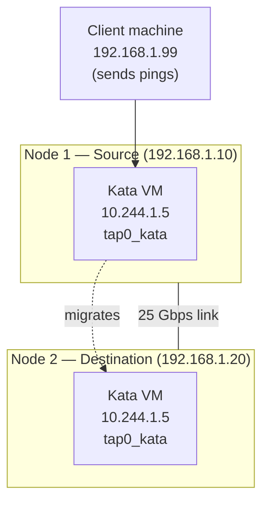
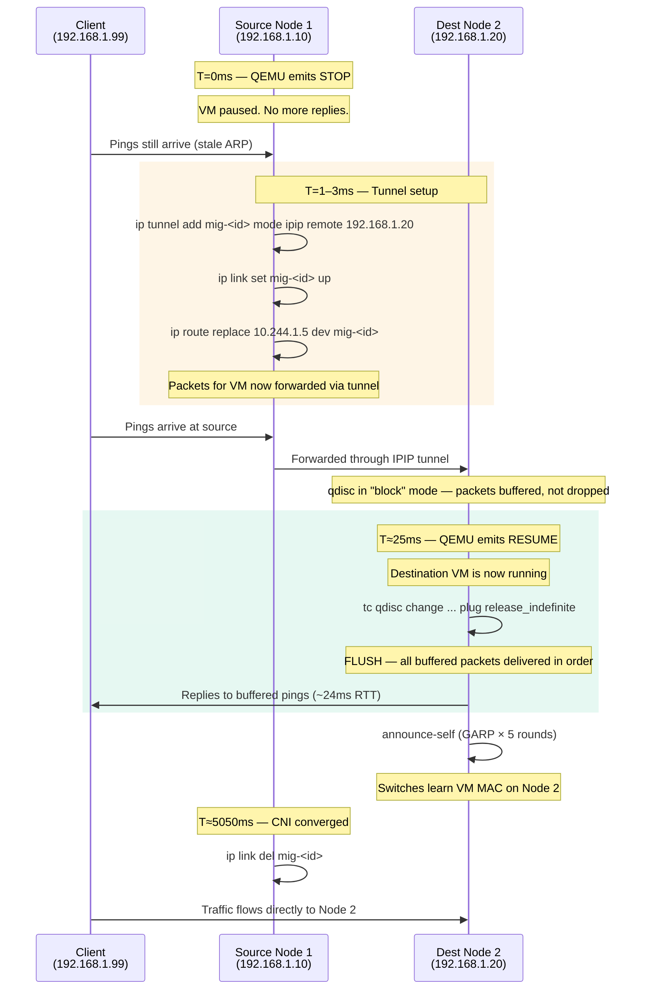
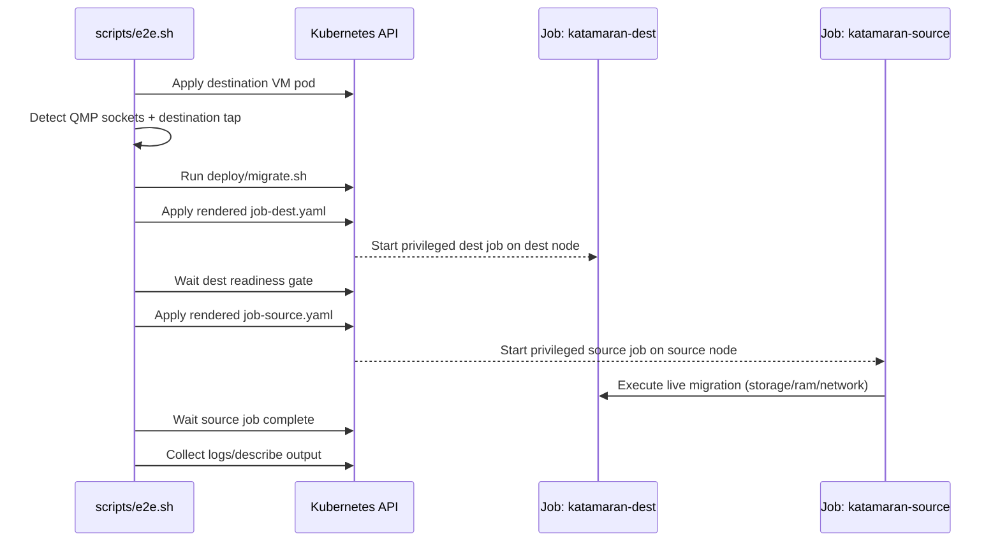

# Testing Guide

### TL;DR

```bash
./scripts/test.sh                                               # smoke tests — no VMs, no KVM, runs anywhere
./scripts/e2e.sh --provider minikube --cni calico --ping-proof  # two-node + zero-drop proof (Calico)
./scripts/e2e.sh --provider minikube --cni ovn --ping-proof     # two-node + zero-drop proof (OVN-Kubernetes)
./scripts/e2e.sh --provider minikube --cni cilium --ping-proof  # two-node + zero-drop proof (Cilium)
./scripts/e2e.sh --provider minikube --cni flannel --ping-proof # two-node + zero-drop proof (Flannel)
./scripts/e2e.sh --provider kind --ping-proof                   # two-node + zero-drop proof (Kind + Podman)
./scripts/e2e.sh --provider minikube --cni calico --storage local --ping-proof  # NBD drive-mirror (full 3-phase)
./scripts/e2e.sh --provider minikube --cni calico --storage nfs --ping-proof    # NFS shared storage
```

All E2E tests need a Linux host with KVM and nested virtualization. Smoke tests run anywhere with Go 1.26+.

> **Note:** E2E tests build the katamaran container image from source and deploy the binary to nodes via a DaemonSet. A pre-built local `bin/katamaran` is not required for E2E tests.

---

E2E tests run on either minikube or Kind with KVM support. No manual QEMU VM provisioning is needed.

## Table of Contents
- [Prerequisites](#prerequisites)
  - [Verify Nested Virtualization](#verify-nested-virtualization)
- [1. Smoke Tests (No VMs Required)](#1-smoke-tests-no-vms-required)
- [2. Fuzz Tests (Go Native Fuzzing)](#2-fuzz-tests-go-native-fuzzing)
- [3. Minikube Smoke Test (Single-Node, Real QMP)](#3-minikube-smoke-test-single-node-real-qmp)
- [4. Two-Node E2E Migration Test](#4-two-node-e2e-migration-test)
- [5. Zero-Packet-Drop Proof — Full Worked Example](#5-zero-packet-drop-proof--full-worked-example)
- [6. OVN-Kubernetes E2E Migration Test (Two-Node, Zero-Drop Proof)](#6-ovn-kubernetes-e2e-migration-test-two-node-zero-drop-proof)
- [7. Cilium E2E Migration Test (Two-Node, Zero-Drop Proof)](#7-cilium-e2e-migration-test-two-node-zero-drop-proof)
- [8. Flannel E2E Migration Test (Two-Node, Zero-Drop Proof)](#8-flannel-e2e-migration-test-two-node-zero-drop-proof)
- [9. Kind + Podman E2E Migration Test (Two-Node, Zero-Drop Proof)](#9-kind--podman-e2e-migration-test-two-node-zero-drop-proof)
- [10. NFS Shared-Storage E2E Migration Test (Two-Node, Zero-Drop Proof)](#10-nfs-shared-storage-e2e-migration-test-two-node-zero-drop-proof)
- [11. Job-Based Orchestration Details (Kind + Podman, Zero-Drop Proof)](#11-job-based-orchestration-details-kind--podman-zero-drop-proof)
- [Troubleshooting](#troubleshooting)

## Prerequisites

- Linux host with KVM support (`/dev/kvm` must exist)
- Nested virtualization enabled (required for Kata Containers inside minikube)
- Go 1.26+ (install system-wide)

### Verify Nested Virtualization

```bash
# Intel
cat /sys/module/kvm_intel/parameters/nested   # should print Y or 1

# AMD
cat /sys/module/kvm_amd/parameters/nested     # should print 1
```

### Disable AVIC on AMD Zen 4+ Hosts

AMD's AVIC (Advanced Virtual Interrupt Controller) is enabled by default on Zen 4/5 CPUs since Linux 6.18. A known errata (#1235) causes KVM page faults during nested guest initialization, which crashes Kata Container VMs with `kvm run failed Bad address` or internal-error exits.

If you have an AMD Zen 4 or newer CPU (Ryzen 7000/9000, EPYC Genoa/Turin), **disable AVIC before running E2E tests**:

```bash
# Check current AVIC status
cat /sys/module/kvm_amd/parameters/avic   # must print N or 0

# If it prints Y or 1, disable it:
sudo modprobe -r kvm_amd && sudo modprobe kvm_amd avic=0

# Verify
cat /sys/module/kvm_amd/parameters/avic   # should now print N
```

To make this persistent across reboots, add `kvm_amd.avic=0` to your kernel command line.

> **Note:** Intel hosts are not affected. AMD Zen 3 and older are not affected (AVIC was not default-on).

## 1. Smoke Tests (No VMs Required)

Validates Go source quality and CLI behavior without any VMs:

```bash
./scripts/test.sh
```

This validates:
- Go source compiles cleanly (`go vet` + `gofmt` + `go build`)
- Binary rejects invalid invocations (missing flags, bad socket, unexpected args, invalid mode)
- Invalid mode produces a specific error message (not just generic usage)
- Source mode missing-flags error mentions `--dest-ip` and `--vm-ip` specifically
- Dest mode QMP error mentions the socket path for debuggability
- Empty mode prints a "Usage" message
- `--help` flag prints descriptions for all flags
- `--shared-storage` flag combinations work correctly
- Invalid IP addresses for `--dest-ip` and `--vm-ip` are rejected with specific error messages
- Valid IP addresses pass validation (fail later at QMP connect, not at validation)
- Shell scripts have valid syntax
- Required project files exist

## 2. Fuzz Tests (Go Native Fuzzing)

Go native fuzz tests cover the QMP protocol parsing layer and configuration formatting — the primary attack surface for untrusted input from QEMU sockets.

### Run Seed Corpus (Unit Test Mode)

The seed corpus runs as standard unit tests — instant, no randomization:

```bash
go test ./internal/qmp/ -run "^Fuzz" -count=1
go test ./internal/migration/ -run "^Fuzz" -count=1
```

### Run Actual Fuzzing

To exercise the fuzzer with random mutations, specify a target and duration:

```bash
go test ./internal/qmp/ -fuzz=FuzzResponseUnmarshal -fuzztime=30s
go test ./internal/qmp/ -fuzz=FuzzClientProtocol -fuzztime=30s
go test ./internal/qmp/ -fuzz=FuzzBlockJobInfoUnmarshal -fuzztime=30s
go test ./internal/qmp/ -fuzz=FuzzMigrateInfoUnmarshal -fuzztime=30s
go test ./internal/qmp/ -fuzz=FuzzErrorFormat -fuzztime=30s
go test ./internal/qmp/ -fuzz=FuzzArgsSerialization -fuzztime=30s
go test ./internal/migration/ -fuzz=FuzzFormatQEMUHost -fuzztime=30s
```

> **Note:** Go fuzzing runs one fuzz target at a time. Each command above fuzzes a single target. Crashing inputs are saved to `testdata/fuzz/<FuzzTargetName>/` and replayed automatically on subsequent `go test` runs.

### Fuzz Targets

| Target | Package | What It Tests |
|--------|---------|---------------|
| `FuzzResponseUnmarshal` | `internal/qmp` | QMP JSON response parsing — the primary wire protocol attack surface |
| `FuzzBlockJobInfoUnmarshal` | `internal/qmp` | `query-block-jobs` output parsing (storage sync polling) |
| `FuzzMigrateInfoUnmarshal` | `internal/qmp` | `query-migrate` output parsing (RAM migration polling) |
| `FuzzErrorFormat` | `internal/qmp` | `Error.Error()` formatting with arbitrary class/desc strings |
| `FuzzClientProtocol` | `internal/qmp` | Full QMP wire protocol: handshake + command execution with arbitrary socket data |
| `FuzzArgsSerialization` | `internal/qmp` | JSON marshaling round-trip for all QMP argument types |
| `FuzzFormatQEMUHost` | `internal/migration` | `formatQEMUHost` with arbitrary IP addresses (IPv4/IPv6 bracket formatting) |

## 3. Minikube Smoke Test (Single-Node, Real QMP)

Validates katamaran against a real Kata Containers QMP socket inside a single-node minikube cluster.

### Additional Requirements

- `minikube`, `kubectl`, `helm` installed
- ~20 GB free disk space, ~16 GB free RAM
- katamaran binary built (`make` or `go build -o bin/katamaran ./cmd/katamaran/`)

### Run

```bash
./scripts/minikube-test.sh          # auto-cleans up after
./scripts/minikube-test.sh --keep   # keep cluster for debugging
./scripts/minikube-test.sh --env-only # stop after environment setup
```

The script:
1. Starts a minikube cluster (KVM2 driver, containerd)
2. Installs Kata Containers via `kata-deploy` Helm chart
3. Enables the extra QMP monitor socket in the Kata configuration
4. Deploys an `nginx:alpine` pod with `runtimeClassName: kata-qemu`
5. Copies katamaran into the minikube node
6. Locates the Kata QMP socket and runs katamaran in dest mode to validate the QMP handshake
7. Tests CLI behavior (invalid mode, usage output)

### What This Validates

- katamaran binary runs correctly on a real Kubernetes node
- QMP socket discovery works with Kata's runtime directory layout
- QMP handshake succeeds with a live Kata VM (proves `qmp.NewClient` + `qmp_capabilities` work end-to-end)
- CLI error handling works in-situ

### What This Does NOT Test

- Actual live migration (requires two nodes)
- Network cutover (IPIP tunnel, sch_plug qdisc)
- Storage mirroring (NBD drive-mirror)

## 4. Two-Node E2E Migration Test

Creates a two-node minikube cluster, installs Kata Containers on both nodes, and runs a full live migration using katamaran.

### Additional Requirements

- Same as the single-node smoke test
- ~30 GB free disk space, ~20 GB free RAM (two KVM nodes)

### Run

```bash
./scripts/e2e.sh --provider minikube --cni calico           # run full e2e, clean up on exit
./scripts/e2e.sh --teardown --provider minikube --cni calico  # destroy cluster only
./scripts/e2e.sh --provider minikube --cni calico --env-only # stop after environment setup
```

The script:
1. Creates a 2-node minikube cluster (KVM2 driver, Calico CNI)
2. Installs Kata Containers via Helm on both nodes
3. Applies E2E-specific Kata QMP and timeout settings on both nodes
4. Builds the container image and deploys katamaran via DaemonSet (binary install and kernel modules)
5. Deploys a source pod on Node 1 with `runtimeClassName: kata-qemu`
6. Removes tc mirred redirect on source pod eth0
7. Deploys a lightweight non-Kata helper pod on Node 2 for network namespace
8. Replays source QEMU command line on Node 2 with path substitutions and `-incoming defer`
9. Runs migration via `deploy/migrate.sh`
10. Reports migration results and destination logs

### What This Validates

- Full live migration pipeline (RAM pre-copy with auto-converge)
- QMP handshake and command execution on both nodes
- QEMU command line replay between source and destination
- Graceful cleanup on success and failure

### Storage Modes

The `--storage` flag controls how the E2E test handles block device migration:

| Mode | Flag | What It Tests | Phases |
|------|------|---------------|--------|
| **none** (default) | `--storage none` | Skips storage mirroring (`--shared-storage`) | RAM + Network |
| **local** | `--storage local` | NBD drive-mirror with local disk images | Storage + RAM + Network |
| **nfs** | `--storage nfs` | Shared NFS-backed disk with `--shared-storage` | RAM + Network (shared disk verified) |

The `local` mode is the most comprehensive: it adds a 64MB virtio-blk data disk to both
QEMUs and runs katamaran without `--shared-storage`, exercising the full NBD drive-mirror
synchronization loop (`waitForStorageSync`, `nbd-server-start/add/stop`, `drive-mirror`,
`block-job-cancel`).

**NFS kernel modules:** The `nfs` mode requires NFS client support in the node kernel
(`CONFIG_NFS_FS`, `CONFIG_SUNRPC`). If using a custom minikube ISO, enable these in the
kernel config alongside `CONFIG_NET_SCH_PLUG`.

## 4b. CRD Path E2E (`--method=crd`)

The same harness can drive migrations through the Migration CRD +
`katamaran-mgr` controller instead of the legacy `deploy/migrate.sh`
shell wrapper. This validates the operator-grade entry point that
GitOps / Argo workflows would use in production.

### Run

```bash
./scripts/e2e.sh --provider minikube --method crd --storage none --ping-proof
```

The harness will:

1. Provision the cluster (or reuse an existing profile) and install
   Kata.
2. Build + load `katamaran-mgr.tar` into the cluster.
3. Apply `config/crd/migration.yaml` and `config/crd/manager.yaml`,
   wait for the controller Deployment to roll out.
4. Submit a `Migration` CR derived from the discovered source pod and
   destination node:

   ```yaml
   apiVersion: katamaran.io/v1alpha1
   kind: Migration
   metadata:
     name: e2e-<timestamp>
     namespace: default
   spec:
     sourcePod: { namespace: default, name: kata-src }
     destNode: <NODE2>
     image: localhost/katamaran:dev
     sharedStorage: <true|false depending on --storage>
     replayCmdline: true
     tunnelMode: none
   ```

5. Poll `.status.phase` to a terminal value (deadline 600 s).
6. Dump the CR yaml and `katamaran-mgr` logs on failure.
7. Delete the CR on success (the finalizer triggers job cleanup).

### What This Validates

In addition to everything `--method=job` covers:

- The Migration CRD's OpenAPI schema accepts the spec the harness
  submits.
- The `katamaran.io/finalizer` is added by the reconciler before
  dispatch and removed during deletion.
- The reconciler's discoverer resolves `spec.sourcePod` to a node and
  `spec.destNode` to an InternalIP so `orchestrator.Request` validation
  passes.
- Per-migration Job names (`katamaran-source-<id>` /
  `katamaran-dest-<id>`) plus the `katamaran.io/migration-id` label
  flow correctly all the way to `kubectl get migration` printer
  columns.
- The structured KATAMARAN_PROGRESS / RESULT / DOWNTIME_LIMIT markers
  surface as `.status.ramTransferred`, `.status.actualDowntimeMS`,
  `.status.appliedDowntimeMS`, `.status.rttMS`, `.status.autoDowntime`.

### Auto-downtime Variant

Set `autoDowntime: true` and (optionally) `autoDowntimeFloorMS: <n>` in
the spec to exercise the ICMP RTT measurement and the configurable
floor. After completion, inspect the CR:

```bash
kubectl get migration <name> -o yaml | yq .status
# .status.autoDowntime: true
# .status.appliedDowntimeMS: 25     # or whatever floor was set
# .status.rttMS:             0      # measured by ICMP echo
# .status.actualDowntimeMS: 14      # what QEMU actually paused for
```

### Operational Endpoints

While the harness runs, the controller exposes (on each `katamaran-mgr`
pod, port 8081):

- `/healthz`, `/readyz` — kubelet probes.
- `/metrics` — Prometheus text-format counters.
- `/debug/vars` — same counters as expvar JSON, plus runtime memstats.

```bash
POD=$(kubectl -n kube-system get pod -l app=katamaran-mgr -o jsonpath='{.items[0].metadata.name}')
kubectl -n kube-system exec "$POD" -- wget -qO- http://localhost:8081/metrics | grep katamaran_
```

## 5. Zero-Packet-Drop Proof — Full Worked Example

This section documents a complete end-to-end live migration with continuous traffic, proving that **zero packets are dropped** during the VM cutover. Every command, its expected output, and the verification steps are shown.

### Topology


```mermaid
graph TD
    subgraph Node1["Node 1 — Source (192.168.1.10)"]
        VM1["Kata VM<br/>10.244.1.5<br/>tap0_kata"]
    end

    subgraph Node2["Node 2 — Destination (192.168.1.20)"]
        VM2["Kata VM<br/>10.244.1.5<br/>tap0_kata"]
    end

    Client["Client machine<br/>192.168.1.99<br/>(sends pings)"]

    Node1 -- "25 Gbps link" --- Node2
    VM1 -. "migrates" .-> VM2
    Client --> VM1
```

- **VM pod IP**: `10.244.1.5` (stays the same after migration)
- **Source node**: `192.168.1.10` (Node 1)
- **Destination node**: `192.168.1.20` (Node 2)
- **Client**: `192.168.1.99` (any machine that can reach the pod IP)

### Requirements

- Two-node Kubernetes cluster with Kata Containers installed
- `sch_plug` kernel module loaded on Node 2 (`modprobe sch_plug`)
- `ipip` kernel module loaded on Node 1 (`modprobe ipip`)
- katamaran binary on both nodes at `/usr/local/bin/katamaran`
- QMP extra-monitor socket enabled in Kata configuration
- Shared storage (Ceph RBD) or local storage (the example below uses shared storage for brevity; with local storage, add the NBD drive-mirror phase)

### Step 0: Identify the QMP Sockets and Tap Interface

On each node, find the Kata sandbox's QMP socket:

```bash
# Node 1 (source)
node1$ sudo find /run/vc -name "extra-monitor.sock"
/run/vc/vm/abc123def456/extra-monitor.sock

# Node 2 (destination) — after the destination pod is created
node2$ sudo find /run/vc -name "extra-monitor.sock"
/run/vc/vm/789xyz000111/extra-monitor.sock
```

On Node 2, identify the tap interface for the destination VM:

```bash
node2$ ip -br link | grep tap
tap0_kata        UP             fe:ab:cd:12:34:56
```

### Step 1: Start the Continuous Ping (Proof Mechanism)

From the client machine, start a flood ping to the VM's pod IP. This runs throughout the entire migration. The `-i 0.01` flag sends one ping every 10ms (100 pings/sec), which is aggressive enough to catch any gap.

```bash
client$ ping -i 0.01 -c 10000 -D 10.244.1.5 | tee /tmp/ping-during-migration.log
```

Expected output (begins immediately, continues during migration):

```text
PING 10.244.1.5 (10.244.1.5) 56(84) bytes of data.
[1708886400.000001] 64 bytes from 10.244.1.5: icmp_seq=1 ttl=64 time=0.412 ms
[1708886400.010002] 64 bytes from 10.244.1.5: icmp_seq=2 ttl=64 time=0.389 ms
[1708886400.020003] 64 bytes from 10.244.1.5: icmp_seq=3 ttl=64 time=0.401 ms
...
```

Leave this running in its own terminal. We will check the final summary after migration completes.

### Step 2: (Optional) Start a tcpdump on Node 1 to Observe Tunnel Forwarding

This is optional but provides visual proof that packets arriving at the source after STOP are forwarded through the IPIP tunnel to the destination.

```bash
node1$ sudo tcpdump -i mig-a1b2c3d4e5 -nn -c 50 2>&1 | tee /tmp/tunnel-capture.log &
```

Replace `mig-a1b2c3d4e5` with the actual tunnel name from the katamaran source log (the name is generated with `mig-` prefix + random hex suffix). This capture must be started **after** the tunnel is created in Step 5 — you can find the name in the source log line "IP tunnel established."

### Step 3: Start katamaran on the Destination (Node 2)

Run the destination side first. It installs the `sch_plug` qdisc, connects to QMP, and waits for the incoming migration.

```bash
node2$ sudo katamaran \
  --mode dest \
  --qmp /run/vc/vm/789xyz000111/extra-monitor.sock \
  --tap tap0_kata \
  --shared-storage
```

Expected output (destination blocks at "Waiting for QEMU RESUME event"):

```text
time=... level=INFO msg="Setting up destination node"
time=... level=INFO msg="Preparing network queue" tap_iface=tap0_kata
time=... level=INFO msg="Network queue installed (pass-through, not plugged yet)" tap_iface=tap0_kata
time=... level=INFO msg="Opening incoming migration listener" uri="tcp:[::]:4444"
time=... level=INFO msg="Shared storage mode: skipping NBD server setup"
time=... level=INFO msg="Network queue plugged. Buffering in-flight packets" tap_iface=tap0_kata
time=... level=INFO msg="Waiting for QEMU RESUME event"
```

**What happened so far on Node 2:**

| Step | Command | Effect |
|------|---------|--------|
| 1a | `tc qdisc add dev tap0_kata root plug limit 32768` | Install sch_plug qdisc |
| 1b | `tc qdisc change dev tap0_kata root plug release_indefinite` | Set to pass-through (traffic flows normally) |
| 4 | `tc qdisc change dev tap0_kata root plug block` | Switch to buffering mode — all arriving packets are queued |

At this point, any packets that arrive at the destination's tap interface are **buffered in the kernel**, not dropped and not delivered. The destination is ready.

### Step 4: Start katamaran on the Source (Node 1)

```bash
node1$ sudo katamaran \
  --mode source \
  --qmp /run/vc/vm/abc123def456/extra-monitor.sock \
  --dest-ip 192.168.1.20 \
  --vm-ip 10.244.1.5 \
  --shared-storage
```

Expected output (with `--shared-storage`, phase 1 — storage mirroring — is skipped):

```text
time=... level=INFO msg="Starting live migration" dest_ip=192.168.1.20
time=... level=INFO msg="Shared storage mode: skipping drive-mirror"
time=... level=INFO msg="Configuring RAM migration"
time=... level=INFO msg="RAM migration started. Waiting for VM to pause (STOP event)"
time=... level=INFO msg="Migration progress" status=active ram_transferred=... ram_total=... ram_remaining=...
time=... level=INFO msg="VM paused. Redirecting in-flight packets to destination"
time=... level=INFO msg="IP tunnel established. Traffic redirected" tunnel=mig-a1b2c3d4e5
time=... level=INFO msg="Waiting for migration to complete"
time=... level=INFO msg="Migration status" status=completed
time=... level=INFO msg="Migration completed" actual_downtime_ms=... total_time_ms=... setup_time_ms=...
time=... level=INFO msg="Waiting for CNI convergence" delay=5s
time=... level=INFO msg="Source cleanup complete. Migration succeeded"
```

### Step 5: What Happened During the Critical Window

The critical zero-drop window is the ~25ms between `STOP` (source VM pauses) and `RESUME` (destination VM starts). Here is the exact sequence and what katamaran did at each moment:


```mermaid
sequenceDiagram
    participant C as Client<br/>(192.168.1.99)
    participant S as Source Node 1<br/>(192.168.1.10)
    participant D as Dest Node 2<br/>(192.168.1.20)

    Note over S: T=0ms — QEMU emits STOP
    Note over S: VM paused. No more replies.
    C->>S: Pings still arrive (stale ARP)

    rect rgb(245, 158, 11, 0.1)
    Note over S,D: T=1–3ms — Tunnel setup
    S->>S: ip tunnel add mig-<id> mode ipip remote 192.168.1.20
    S->>S: ip link set mig-<id> up
    S->>S: ip route replace 10.244.1.5 dev mig-<id>
    Note over S: Packets for VM now forwarded via tunnel
    end

    C->>S: Pings arrive at source
    S->>D: Forwarded through IPIP tunnel
    Note over D: qdisc in "block" mode — packets buffered, not dropped

    rect rgb(16, 185, 129, 0.1)
    Note over D: T≈25ms — QEMU emits RESUME
    Note over D: Destination VM is now running
    D->>D: tc qdisc change ... plug release_indefinite
    Note over D: FLUSH — all buffered packets delivered in order
    D->>C: Replies to buffered pings (~24ms RTT)
    end

    D->>D: announce-self (GARP × 5 rounds)
    Note over D: Switches learn VM MAC on Node 2

    Note over S: T≈5050ms — CNI converged
    S->>S: ip link del mig-<id>
    C->>D: Traffic flows directly to Node 2
```

Meanwhile, on the destination side, the output completes:

```text
time=... level=INFO msg="VM resumed. Flushing buffered packets"
time=... level=INFO msg="Queue unplugged. Buffered packets delivered. Zero drops achieved"
time=... level=INFO msg="Broadcasting Gratuitous ARP via QEMU announce-self"
time=... level=INFO msg="GARP announce-self scheduled" rounds=5
time=... level=INFO msg="Destination setup complete"
```

### Step 6: Check the Ping Results (THE PROOF)

After migration completes, stop the ping on the client (`Ctrl+C`) and examine the summary:

```bash
client$ # (ping finishes or Ctrl+C)
```

Expected final output:

```text
[1708886400.000001] 64 bytes from 10.244.1.5: icmp_seq=1 ttl=64 time=0.412 ms
[1708886400.010002] 64 bytes from 10.244.1.5: icmp_seq=2 ttl=64 time=0.389 ms
...
[1708886403.070999] 64 bytes from 10.244.1.5: icmp_seq=308 ttl=64 time=0.401 ms  ← last pre-migration reply
[1708886403.081000] 64 bytes from 10.244.1.5: icmp_seq=309 ttl=64 time=24.712 ms ← during cutover (buffered, then flushed)
[1708886403.091001] 64 bytes from 10.244.1.5: icmp_seq=310 ttl=64 time=23.331 ms ← also buffered, flushed together
[1708886403.101002] 64 bytes from 10.244.1.5: icmp_seq=311 ttl=64 time=22.019 ms ← also buffered
[1708886403.111003] 64 bytes from 10.244.1.5: icmp_seq=312 ttl=64 time=21.705 ms ← also buffered
[1708886403.121004] 64 bytes from 10.244.1.5: icmp_seq=313 ttl=64 time=0.523 ms  ← first direct reply from Node 2
[1708886403.131005] 64 bytes from 10.244.1.5: icmp_seq=314 ttl=64 time=0.498 ms
...

--- 10.244.1.5 ping statistics ---
10000 packets transmitted, 10000 received, 0% packet loss, time 99990ms
rtt min/avg/max/mdev = 0.312/0.847/48.712/2.431 ms
```

**Key observations:**

| Metric | Value | Meaning |
|--------|-------|---------|
| **Packets transmitted** | 10000 | Client sent 10,000 pings |
| **Packets received** | 10000 | All 10,000 were answered |
| **Packet loss** | **0%** | **Zero drops** |
| **Max RTT** | ~24ms | Packets buffered during cutover window had higher RTT |
| **Normal RTT** | ~0.4ms | Pre- and post-migration latency |

The packets with elevated RTT (icmp_seq 309-312 in the example) are the ones that arrived during the STOP→RESUME window. They were:
1. Forwarded from Node 1 to Node 2 via the IPIP tunnel
2. Buffered by the `sch_plug` qdisc on Node 2's tap interface
3. Flushed into the VM when `release_indefinite` was issued after RESUME

They were **not dropped** — they just had higher latency because they spent ~25ms in the buffer.

### Step 7: Verify the Tunnel Was Used (Optional)

Check the tcpdump capture from Step 2:

```bash
node1$ cat /tmp/tunnel-capture.log
```

Expected output:

```text
tcpdump: verbose output suppressed, use -v for full protocol decode
listening on mig-a1b2c3d4e5, link-type RAW (Raw IP), capture size 262144 bytes
04:30:08.001234 IP 192.168.1.99 > 10.244.1.5: ICMP echo request, id 12345, seq 309, length 64
04:30:08.011235 IP 192.168.1.99 > 10.244.1.5: ICMP echo request, id 12345, seq 310, length 64
04:30:08.021236 IP 192.168.1.99 > 10.244.1.5: ICMP echo request, id 12345, seq 311, length 64
04:30:08.031237 IP 192.168.1.99 > 10.244.1.5: ICMP echo request, id 12345, seq 312, length 64
```

This confirms that ICMP packets arriving at the source after the VM paused were encapsulated and forwarded through the IPIP tunnel to the destination.

### Step 8: Verify the Qdisc Buffering Worked (Optional)

On Node 2, check the qdisc statistics to confirm packets were buffered and then released:

```bash
# Run this BEFORE katamaran dest completes (while qdisc is still installed):
node2$ tc -s qdisc show dev tap0_kata

qdisc plug 8001: root refcnt 2 limit 32768b
 Sent 5120 bytes 20 pkt (dropped 0, overlimits 0 requeues 0)
 backlog 0b 0p requeues 0
```

| Field | Value | Meaning |
|-------|-------|---------|
| **Sent** | 20 pkt | 20 packets passed through the qdisc |
| **dropped** | **0** | Zero packets dropped by the qdisc |
| **backlog** | 0b 0p | Queue is empty (all buffered packets were flushed) |

The `dropped 0` confirms the qdisc buffer did not overflow. The `backlog 0b 0p` confirms all buffered packets were successfully flushed into the VM.

### Step 9: Verify Host Routing State Is Clean

After migration, verify no tunnel or qdisc artifacts remain:

```bash
# Node 1: tunnel should be gone
node1$ ip tunnel show
# (no mig-* entry)

node1$ ip route show 10.244.1.5
# (no route — tunnel was torn down)

# Node 2: qdisc should be gone (removed when tap interface goes down,
# or explicitly by katamaran if the tap stays up)
node2$ tc qdisc show dev tap0_kata
qdisc pfifo_fast 0: root refcnt 2 bands 3 priomap ...
# (back to default qdisc, no plug)
```

### Why This Proves Zero Drops

The proof rests on three mechanisms working together:

1. **IPIP tunnel (source side)**: After STOP, packets for the VM IP that still arrive at the source node (due to stale ARP/routing) are forwarded through the tunnel to the destination node instead of being dropped by the now-dead local VM.

2. **sch_plug qdisc (destination side)**: The destination tap interface buffers all arriving packets (both direct and tunnel-forwarded) in the kernel while the VM is paused. No packet enters the VM until RESUME, and no packet is dropped — they are held in a 32 KB kernel buffer.

3. **Ordered flush (release_indefinite)**: After RESUME, all buffered packets are delivered to the VM in the exact order they arrived. The VM processes them and replies normally. The elevated RTT on these packets (~24ms) is the time spent in the buffer, not retransmission.

The `0% packet loss` in the ping summary is the definitive proof. Without katamaran's tunnel + qdisc, the same migration would show packet loss during the STOP→RESUME window because:
- Packets arriving at the source have no VM to receive them (it's paused)
- Packets arriving at the destination have no VM to receive them (it hasn't resumed yet)
- The CNI hasn't updated its routes yet (takes 1-5 seconds depending on the plugin)

### Full Storage Mode (Non-Shared)

With local storage, the output includes the additional NBD drive-mirror phase. The source output looks like:

```bash
node1$ sudo katamaran \
  --mode source \
  --qmp /run/vc/vm/abc123def456/extra-monitor.sock \
  --dest-ip 192.168.1.20 \
  --vm-ip 10.244.1.5 \
  --drive-id drive-virtio-disk0
```

```text
time=... level=INFO msg="Starting live migration" dest_ip=192.168.1.20
time=... level=INFO msg="Initiating storage mirror (drive-mirror)"
time=... level=INFO msg="Waiting for storage mirror to synchronize"
time=... level=INFO msg="Storage sync progress" progress_pct=12.50 offset=... len=...
time=... level=INFO msg="Storage sync progress" progress_pct=25.00 offset=... len=...
time=... level=INFO msg="Storage sync progress" progress_pct=50.00 offset=... len=...
time=... level=INFO msg="Storage sync progress" progress_pct=75.00 offset=... len=...
time=... level=INFO msg="Storage mirror synchronized" elapsed=...
time=... level=INFO msg="Configuring RAM migration"
time=... level=INFO msg="RAM migration started. Waiting for VM to pause (STOP event)"
time=... level=INFO msg="VM paused. Redirecting in-flight packets to destination"
time=... level=INFO msg="IP tunnel established. Traffic redirected" tunnel=mig-a1b2c3d4e5
time=... level=INFO msg="Waiting for migration to complete"
time=... level=INFO msg="Migration status" status=active
time=... level=INFO msg="Migration status" status=completed
time=... level=INFO msg="Migration completed" actual_downtime_ms=... total_time_ms=... setup_time_ms=...
time=... level=INFO msg="Storage mirror cancelled"
time=... level=INFO msg="Waiting for CNI convergence" delay=5s
time=... level=INFO msg="Source cleanup complete. Migration succeeded"
```

And the destination output includes the NBD server:

```text
time=... level=INFO msg="Setting up destination node"
time=... level=INFO msg="Preparing network queue" tap_iface=tap0_kata
time=... level=INFO msg="Network queue installed (pass-through, not plugged yet)" tap_iface=tap0_kata
time=... level=INFO msg="Opening incoming migration listener" uri="tcp:[::]:4444"
time=... level=INFO msg="Starting NBD server for storage migration"
time=... level=INFO msg="NBD server listening" addr="[::]" port=10809
time=... level=INFO msg="Network queue plugged. Buffering in-flight packets" tap_iface=tap0_kata
time=... level=INFO msg="Waiting for QEMU RESUME event"
time=... level=INFO msg="VM resumed. Flushing buffered packets"
time=... level=INFO msg="Queue unplugged. Buffered packets delivered. Zero drops achieved"
time=... level=INFO msg="NBD server stopped"
time=... level=INFO msg="Broadcasting Gratuitous ARP via QEMU announce-self"
time=... level=INFO msg="GARP announce-self scheduled" rounds=5
time=... level=INFO msg="Destination setup complete"
```

The zero-drop behavior is identical — the tunnel and qdisc protect the network cutover regardless of whether storage was mirrored via NBD or shared.

### Summary of Proof Artifacts

| Artifact | Location | What It Proves |
|----------|----------|----------------|
| Ping summary | Client terminal | `0% packet loss` — no drops |
| Ping RTT spike | `icmp_seq` 309-312 | Packets were buffered (~24ms), not dropped |
| tcpdump on mig-\<id\> | `/tmp/tunnel-capture.log` | Packets were forwarded via IPIP tunnel |
| tc qdisc stats | `tc -s qdisc show` | `dropped 0`, `backlog 0` — buffer worked |
| katamaran dest log | `Queue unplugged. Buffered packets delivered.` | Flush succeeded |
| katamaran source log | `IP tunnel established. Traffic redirected.` | Tunnel was created |
| Host route cleanup | `ip tunnel show` / `ip route show` | No leaked state |

## 6. OVN-Kubernetes E2E Migration Test (Two-Node, Zero-Drop Proof)

Creates a two-node minikube cluster with **OVN-Kubernetes** as the CNI, runs a full live migration, and **automatically verifies zero packet loss** by running a continuous ping throughout the migration.

OVN-Kubernetes provides the best CNI integration for live migration: its centralized OVN southbound database updates port-chassis bindings near-instantly, and `announce-self` GARP accelerates MAC learning on the OVS bridges.

### Why Test with OVN-Kubernetes?

| Feature | OVN-Kubernetes | Calico (e2e.sh --cni calico) |
|---------|---------------|------------------------|
| Port rebinding | OVN southbound DB (atomic) | BGP route propagation (2-5s) |
| MAC learning | OVS + GARP | Kernel bridge + GARP |
| Convergence time | < 1s | 2-5s |
| Tunnel gap coverage | Minimal (OVN converges fast) | Longer (BGP propagation) |

The IPIP tunnel and sch_plug qdisc cover the gap regardless of CNI, but OVN-Kubernetes is the recommended production CNI for the shortest possible convergence window.

### Additional Requirements

- Same as the Calico E2E test (minikube, kubectl, helm, KVM)
- `git` (to clone the OVN-Kubernetes Helm chart)
- ~30 GB free disk space, ~20 GB free RAM (two KVM nodes + OVN components)

### Run

```bash
./scripts/e2e.sh --provider minikube --cni ovn --ping-proof
./scripts/e2e.sh --teardown --provider minikube --cni ovn
```

### What the Script Does

1. Creates a 2-node minikube cluster with **bridge CNI** (`--cni=bridge`), which is replaced by OVN-Kubernetes
2. Clones OVN-Kubernetes and deploys it via Helm (OVN DB, ovnkube-master, ovnkube-node)
3. Waits for OVN-K pods and CoreDNS to be ready (proves CNI is functional)
4. Installs Kata Containers via Helm on both nodes
5. Applies E2E-specific Kata QMP and timeout settings on both nodes
6. Builds the container image and deploys katamaran via DaemonSet (binary install and kernel modules)
7. Deploys a source pod on Node 1 with `runtimeClassName: kata-qemu`
8. Removes tc mirred redirect on source pod eth0
9. Deploys a lightweight helper pod on Node 2 and replays source QEMU command line
10. Runs migration via `deploy/migrate.sh`
11. Verifies zero-drop proof via `--ping-proof` log pattern checks
12. Reports OVN-K pod status

### Expected Output

The script produces a structured report at the end:

```text
=== E2E MIGRATION RESULTS ===
  PASS: Migration completed successfully!
  40 packets transmitted, 40 received, 0% packet loss, time 2056ms
  PASS: ZERO PACKET LOSS VERIFIED
```

### What This Validates

- Full live migration pipeline with OVN-Kubernetes CNI
- OVN port-chassis rebinding after migration
- Zero packet loss during STOP→RESUME window (automated proof)
- GARP (`announce-self`) interaction with OVS MAC learning
- IPIP tunnel forwarding works through OVN-managed network
- sch_plug qdisc buffering and flush on OVN-managed tap interface

### Artifacts

| Artifact | How to Collect | Contents |
|----------|----------------|----------|
| Source job logs | `kubectl logs -n kube-system job/katamaran-source` | Full source-side katamaran output |
| Dest job logs | `kubectl logs -n kube-system job/katamaran-dest` | Full destination-side katamaran output |

## 7. Cilium E2E Migration Test (Two-Node, Zero-Drop Proof)

Creates a two-node cluster with **Cilium** as the CNI (eBPF datapath), runs a full live migration, and verifies zero packet loss. Works with both minikube and Kind.

Cilium's eBPF datapath reconverges after the destination endpoint is registered. The IPIP tunnel and sch_plug qdisc cover the 1–3s gap until Cilium's agent installs the new eBPF maps.

### Requirements

- Same as the Calico E2E test (minikube or kind, kubectl, helm, KVM)
- `helm` (Cilium is installed via Helm from `oci://quay.io/cilium/charts/cilium`)

### Run

```bash
./scripts/e2e.sh --provider minikube --cni cilium --ping-proof
./scripts/e2e.sh --teardown --provider minikube --cni cilium

./scripts/e2e.sh --provider kind --cni cilium --ping-proof
./scripts/e2e.sh --teardown --provider kind --cni cilium
```

### What the Script Does

1. Creates a 2-node cluster with **no built-in CNI** (`--cni=bridge` for minikube, `disableDefaultCNI: true` for Kind)
2. Installs Cilium via Helm (`oci://quay.io/cilium/charts/cilium`) with `ipam.mode=kubernetes`
3. Waits for the `cilium` DaemonSet and all nodes to be Ready
4. Installs Kata Containers via Helm on both nodes
5. Applies E2E-specific Kata QMP and timeout settings, then deploys katamaran via DaemonSet
6. Deploys source pod and replays its QEMU command line in a destination helper pod
7. Starts continuous ping and runs migration
8. Reports zero-drop proof

## 8. Flannel E2E Migration Test (Two-Node, Zero-Drop Proof)

Creates a two-node cluster with **Flannel** as the CNI (VXLAN overlay), runs a full live migration, and verifies zero packet loss. Works with both minikube and Kind.

Flannel's VXLAN FDB entries are updated via GARP after migration. The IPIP tunnel covers the 2–5s convergence window while `flanneld` updates FDB entries on all nodes.

### Requirements

- Same as the Calico E2E test (minikube or kind, kubectl, helm, KVM)

### Run

```bash
./scripts/e2e.sh --provider minikube --cni flannel --ping-proof
./scripts/e2e.sh --teardown --provider minikube --cni flannel

./scripts/e2e.sh --provider kind --cni flannel --ping-proof
./scripts/e2e.sh --teardown --provider kind --cni flannel
```

### What the Script Does

1. Creates a 2-node cluster with **no built-in CNI** (`--cni=bridge` for minikube, `disableDefaultCNI: true` for Kind)
2. Installs Flannel via `kubectl apply` from the upstream release manifest
3. Waits for the `kube-flannel-ds` DaemonSet in `kube-flannel` namespace and all nodes to be Ready
4. Installs Kata Containers via Helm on both nodes
5. Applies E2E-specific Kata QMP and timeout settings, then deploys katamaran via DaemonSet
6. Deploys source pod and replays its QEMU command line in a destination helper pod
7. Starts continuous ping and runs migration
8. Reports zero-drop proof

## 9. Kind + Podman E2E Migration Test (Two-Node, Zero-Drop Proof)

Alternative to the minikube-based tests for environments that have Podman instead of (or in addition to) KVM-based minikube. Kind uses container "nodes" with `/dev/kvm` passed through for nested Kata Containers virtualization.

### Why Kind + Podman?

| Feature | Kind + Podman | Minikube (kvm2) |
|---------|--------------|-----------------|
| Node isolation | Containers (lightweight) | Full VMs (heavier) |
| Startup time | ~30 seconds | ~2–5 minutes |
| Container runtime | Podman (rootful) | KVM/libvirt |
| CNI | kindnet (default) | Calico, OVN-K, etc. |
| KVM requirement | `/dev/kvm` mount into containers | Nested virtualization |
| Disk footprint | ~5 GB | ~20 GB |

Kind is faster to spin up and tear down, making it useful for CI pipelines. The trade-off is that Kind's container-based "nodes" share the host kernel, so kernel module loading (ipip, sch_plug, ip_gre) affects the host.

### Requirements

- Linux host with KVM (`/dev/kvm` accessible)
- `kind`, `kubectl`, `helm`, `podman` installed
- Rootful Podman (Kind's Podman provider requires it)
- ~20 GB free disk space, ~16 GB free RAM

### Running

```bash
./scripts/e2e.sh --provider kind --ping-proof
./scripts/e2e.sh --teardown --provider kind
```

### What the Script Does

1. Creates a 2-node Kind cluster with Podman provider and `/dev/kvm` mounted
2. Verifies `/dev/kvm` is accessible inside both node containers
3. Installs Kata Containers via Helm (qemu shim only)
4. Applies E2E-specific Kata QMP and timeout settings on both nodes
5. Builds the container image and deploys katamaran via DaemonSet (binary install and kernel modules)
6. Deploys source pod on control-plane, removes tc mirred redirect
7. Deploys helper pod on worker node and replays source QEMU command line
8. Runs migration via `deploy/migrate.sh`
9. Verifies zero-drop proof via `--ping-proof` log pattern checks
10. Reports migration result

### Key Differences from Minikube Scripts

| Operation | Minikube | Kind + Podman |
|-----------|----------|---------------|
| Node access | `minikube ssh -n <node>` | `podman exec <container>` |
| File copy | `minikube cp` | `podman cp` |
| Cluster create | `minikube start --driver=kvm2` | `KIND_EXPERIMENTAL_PROVIDER=podman kind create cluster` |
| Node names | `<profile>`, `<profile>-m02` | `<cluster>-control-plane`, `<cluster>-worker` |
| CNI | Calico / OVN-K (configurable) | kindnet (default) |
| systemd | Available via minikube ssh | Available (Kind nodes run systemd) |

### Expected Output

```text
>>> Starting katamaran SOURCE on control-plane (migrating to 10.89.0.3)...
  Starting live migration to 10.89.0.3...
  Shared storage mode: skipping drive-mirror.
  Configuring RAM migration...
  RAM migration started. Waiting for VM to pause (STOP event)...
  VM paused. Redirecting in-flight packets to destination...
  IP tunnel established. Traffic redirected.
  Migration status: completed
  Source cleanup complete. Migration succeeded.

========================================================================
=== ZERO-DROP PING PROOF ===
========================================================================

  30 packets transmitted, 30 received, 0% packet loss, time 1450ms

  PASS: ZERO PACKET LOSS: 30 transmitted, 30 received, 0% loss

  rtt min/avg/max/mdev = 0.215/1.923/35.412/6.108 ms

--- Packets with elevated RTT (>10ms, likely buffered during cutover) ---
  64 bytes from 10.244.0.5: icmp_seq=18 ttl=64 time=35.412 ms
  64 bytes from 10.244.0.5: icmp_seq=19 ttl=64 time=34.891 ms

========================================================================
=== SUMMARY ===
========================================================================

=== E2E MIGRATION RESULTS ===
  PASS: Migration completed successfully!
  30 packets transmitted, 30 received, 0% packet loss, time 1450ms
  PASS: ZERO PACKET LOSS VERIFIED
```

### Artifacts

| Artifact | How to Collect | Contents |
|----------|----------------|----------|
| Source job logs | `kubectl logs -n kube-system job/katamaran-source` | Full source-side katamaran output |
| Dest job logs | `kubectl logs -n kube-system job/katamaran-dest` | Full destination-side katamaran output |

## 10. NFS Shared-Storage E2E Migration Test (Two-Node, Zero-Drop Proof)

Validates katamaran's `--shared-storage` mode with a real NFS server running in-cluster. This is the only E2E test that exercises shared storage backed by an actual network filesystem, proving the production workflow for Ceph RBD / NFS backends where NBD drive-mirror is skipped entirely.

### Why Test with NFS?

The default `--storage none` E2E mode uses `--shared-storage` only to skip the storage phase. The `--storage nfs` mode deploys an NFS server pod, mounts that export on both nodes, and hotplugs the same shared disk image into the source and destination QEMUs. It proves:

- The NFS export and shared disk image are accessible from both nodes
- Data written before migration survives the cutover
- katamaran correctly skips the NBD drive-mirror phase
- The full RAM + network cutover pipeline works with real shared storage

### Requirements

- Linux host with KVM and nested virtualization enabled
- `minikube`, `kubectl`, `helm` installed
- ~20 GB free disk space, ~16 GB free RAM

### Running

```bash
./scripts/e2e.sh --provider minikube --cni calico --storage nfs --ping-proof
./scripts/e2e.sh --teardown --provider minikube --cni calico --storage nfs
```

### What the Script Does

1. Creates a 2-node minikube cluster (kvm2, Calico CNI)
2. Installs Kata Containers and applies the E2E Kata configuration overrides
3. Builds the container image and deploys katamaran via DaemonSet
4. Deploys an NFS server pod on Node 1
5. Loads NFS kernel modules, mounts the NFS export on both nodes, and creates a shared raw disk image
6. Deploys source Kata pod on Node 1
7. Hotplugs the shared NFS-backed disk image into the source QEMU
8. Removes tc mirred redirect on source pod eth0
9. Deploys helper pod on Node 2 and replays source QEMU command line
10. Hotplugs the same shared disk image into the destination QEMU
11. Runs katamaran migration with `--shared-storage` (skips NBD)
12. Verifies zero-drop proof via `--ping-proof` log pattern checks
13. Reports migration result

### Expected Output

```
>>> Starting katamaran SOURCE on Node 1 (migrating to 192.168.39.12) with --shared-storage...
  Starting live migration to 192.168.39.12...
  Shared storage mode: skipping drive-mirror.
  Configuring RAM migration...
  RAM migration started. Waiting for VM to pause (STOP event)...
  VM paused. Redirecting in-flight packets to destination...
  IP tunnel established. Traffic redirected.
  Migration status: completed
  Source cleanup complete. Migration succeeded.

=== E2E MIGRATION RESULTS ===
  PASS: Migration completed successfully!
  PASS: NFS data intact after migration
  30 packets transmitted, 30 received, 0% packet loss, time 1450ms
  PASS: ZERO PACKET LOSS VERIFIED
```

### Artifacts

| Artifact | How to Collect | Contents |
|----------|----------------|----------|
| Source job logs | `kubectl logs -n kube-system job/katamaran-source` | Full source-side katamaran output |
| Dest job logs | `kubectl logs -n kube-system job/katamaran-dest` | Full destination-side katamaran output |

## 11. Job-Based Orchestration Details (Kind + Podman, Zero-Drop Proof)

This section details the Job-based orchestration used by all E2E tests. Kubernetes Jobs (via `deploy/migrate.sh`) execute the migration on each node, which mirrors the production deployment model where a controller creates Jobs.

### Requirements

Same as Kind + Podman test (Section 9).

### Running

```bash
./scripts/e2e.sh --provider kind --ping-proof
./scripts/e2e.sh --teardown --provider kind
```

### Job Orchestration Topology


```mermaid
sequenceDiagram
    participant T as scripts/e2e.sh
    participant K as Kubernetes API
    participant D as Job: katamaran-dest
    participant S as Job: katamaran-source

    T->>K: Apply destination VM pod
    T->>T: Detect QMP sockets + destination tap
    T->>K: Run deploy/migrate.sh
    T->>K: Apply rendered job-dest.yaml
    K-->>D: Start privileged dest job on dest node
    T->>K: Wait dest readiness gate
    T->>K: Apply rendered job-source.yaml
    K-->>S: Start privileged source job on source node
    S->>D: Execute live migration (storage/ram/network)
    T->>K: Wait source job complete
    T->>K: Collect logs/describe output
```

### What the Script Does

1. Creates a 2-node Kind cluster (Podman provider, /dev/kvm mount)
2. Installs Kata Containers via Helm
3. Applies E2E-specific Kata QMP and timeout settings on both nodes
4. Builds the container image and deploys katamaran via DaemonSet (binary install and kernel modules)
5. Deploys source pod, removes tc mirred redirect
6. Deploys helper pod on destination node and replays source QEMU command line
7. Executes migration via `deploy/migrate.sh` (K8s Jobs)
8. Verifies zero-drop proof via `--ping-proof` log pattern checks
9. Collects results and reports

### Job Orchestration Details

| Component | Description |
|-----------|-------------|
| Dest execution | K8s Job (`deploy/job-dest.yaml`) — privileged pod on destination node |
| Source execution | K8s Job (`deploy/job-source.yaml`) — privileged pod on source node |
| Orchestration | `deploy/migrate.sh` — renders templates via `envsubst`, applies jobs, waits for completion |
| Binary deployment | DaemonSet installs binary; Jobs use the container image |
| Log collection | `kubectl logs -n kube-system job/katamaran-source`, `kubectl logs -n kube-system job/katamaran-dest` |

## Troubleshooting

> [!NOTE]
> If you encounter issues, ensure all kernel modules and QMP connection paths are correctly set up on your host or Minikube node.

| Error | Cause | Resolution |
|-------|-------|------------|
| `dialing QMP socket` | Wrong socket path or VM not running | Verify `ls /run/vc/vm/*/extra-monitor.sock` |
| `failed to add plug qdisc` | `sch_plug` module not loaded | `modprobe sch_plug` |
| `starting NBD server` | Port 10809 already in use | Check `ss -tlnp \| grep 10809` |
| `starting drive-mirror` | Destination NBD not ready | Ensure dest mode is running first |
| `migration failed` | Insufficient resources or network issue | Check QEMU logs; verify dest is reachable on port 4444 |
| `migration: context deadline exceeded` | Migration never converged within `migrationTimeout` (dirty page churn) | Reduce VM workload or increase `migrationTimeout` constant |
| `storage sync: context deadline exceeded` | Drive-mirror never converged within `storageSyncTimeout` (VM write rate too high) | Reduce VM disk I/O or increase `storageSyncTimeout` constant |
| `timed out waiting for QMP response` | QEMU unresponsive mid-command | Check QEMU process health; may need restart |
| `connection is closed` | QMP command issued after socket was closed | Indicates a bug or QEMU crashed mid-operation; check QEMU logs |
| `kvm run failed Bad address` or VM internal-error | AVIC enabled on AMD Zen 4/5 (errata #1235) | Disable AVIC: `modprobe -r kvm_amd && modprobe kvm_amd avic=0` |
| minikube won't start | KVM not available or nested virt disabled | Check `/dev/kvm` exists and nested virt is enabled |
| kata-deploy pod not starting | Image pull issues or resource constraints | Check pod events: `kubectl -n kube-system describe pod -l name=kata-deploy` |
| No extra-monitor.sock found | extra_monitor_socket not configured | Verify `enable_debug = true` and `extra_monitor_socket = "qmp"` in Kata config |
